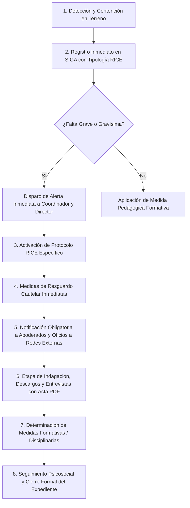

# GUÍA MAESTRA DE DEFENSA: MODELO DE NEGOCIO, MERCADO Y DOMINIO ESCOLAR
## Proyecto: SIGA Escolar (Sistema de Gestión y Acompañamiento Escolar)
### Caso de Aplicación Real: Escuela Coeducacional N°1 El Salvador (Atacama, Chile)

---

## 1. RESUMEN EJECUTIVO: LA PERSPECTIVA DE NEGOCIO Y EMPRENDIMIENTO

En una defensa de titulación o evaluación de proyecto de software, la comisión evaluadora busca certificar que los graduados no son únicamente desarrolladores técnicos, sino **Ingenieros de Software que comprenden el modelo de negocio, el entorno regulatorio, la dinámica operativa, las finanzas públicas y el dolor real del cliente**.

> **Definición Estratégica del Negocio:**  
> SIGA Escolar es una solución **Vertical Especializada (*Best-of-Breed*) EdTech B2B/B2G** diseñada para digitalizar, estructurar y blindar legalmente el ciclo de vida de la convivencia escolar y el cumplimiento normativo en establecimientos educacionales de Chile, transformando una gestión manual punitiva y en papel en un ecosistema formativo, predictivo y auditable.

---

## 2. EL CLIENTE Y EL CASO DE ESTUDIO REAL

### 2.1. Ficha Técnica del Establecimiento
* **Nombre de la Institución:** Escuela Coeducacional N°1 El Salvador.
* **Ubicación Geográfica:** Campamento Minero El Salvador, Comuna de Diego de Almagro, Región de Atacama (zona de influencia directa de Codelco División Salvador).
* **Dependencia Administrativa:** **Pública** — Dependiente del **SLEP Atacama** (Servicio Local de Educación Pública, Ley N° 21.040 de Nueva Educación Pública).
* **Población Escolar:** **483 estudiantes matriculados**, desde Educación Parvularia (Prekínder y Kínder) hasta Educación Básica/Media.
* **Régimen Horario:** Dos jornadas lectivas continuas (mañana y tarde).
* **Equipo Profesional:** Cuerpo docente de aula, profesores jefes, asistentes de la educación, inspectores de patio y un equipo psicosocial especializado (Dupla Psicosocial / Encargado de Inclusión y PIE - Programa de Integración Escolar).

### 2.2. Métricas y Volumen Operacional Real (El "Dolor Operacional")
Antes de la llegada de SIGA Escolar, el diagnóstico institucional arrojó las siguientes cifras críticas:
* **Volumen de Incidentes Semanales:** Entre **25 y 35 incidentes semanales** registrados en terreno (~1.200 a 1.400 eventos por año escolar) que debían ser tipificados, atendidos y documentados.
* **Tiempo de Redacción Manual:** Un profesional de convivencia o inspector demoraba un promedio de **20 minutos por caso** en transcribir del cuaderno borrador a Word, imprimir el acta física y archivarla. Con SIGA Escolar, el tiempo de emisión de actas y reportes oficiales se redujo a **menos de 3 minutos** (ahorro superior al 65% del tiempo administrativo).
* **Pérdida de Trazabilidad:** Al manejarse en cuadernos físicos y planillas Excel locales descentralizadas, el **40% de los incidentes leves reiterados no eran detectados como patrones de bullying temprano**, explosionando semanas después en faltas graves o agresiones físicas.
* **Riesgo Legal Inminente:** Retrasos en la notificación a apoderados y pérdida de carpetas físicas ponían a la escuela en riesgo permanente de multas ante la Superintendencia de Educación por faltas al debido proceso.

---

## 3. MAPEO DETALLADO DE STAKEHOLDERS (MATRIZ DE IMPACTO)

En un colegio, el software interactúa con diferentes perfiles con intereses y dolores disímiles:

| Stakeholder / Actor Clave | Rol Organizacional | Dolor / Preocupación Principal | Valor Entregado por SIGA Escolar |
| :--- | :--- | :--- | :--- |
| **Rodrigo Pacheco Contreras** | **Director del Establecimiento** (Máxima autoridad legal) | Multas de la Superintendencia, demandas de apoderados, pérdida de subvención escolar y daño a la reputación institucional. | Dashboard ejecutivo con macroindicadores en tiempo real, trazabilidad 100% auditable y resguardo legal ante fiscalizaciones. |
| **Roberto Eduardo Miranda Vivanco** | **Coordinador de Convivencia Escolar** (SME / Cliente Directo) | Sobrecarga burocrática (70% del tiempo llenando papeles), descontrol de plazos fatales (<48h) e inseguridad en la redacción técnica de informes. | Tablero Kanban de protocolos RICE, semáforos de plazos legales de vencimiento, asistente de actas estructuradas y buscador semántico de antecedentes. |
| **Inspectoría General** | Unidad Directiva Disciplinaria | Falta de consolidación de faltas, libros de novedades saturados y dificultad para citar apoderados con evidencia irrefutable. | Consolidación cronológica inmediata del historial del alumno, citación formal con actas PDF y alertas en incidentes graves/gravísimos. |
| **Cuerpo de Inspectores de Patio** | Operadores de Primera Línea en Terreno | No pueden andar con computadores pesados en el recreo; necesitan registrar la pelea o la falta en menos de 2 minutos. | Interfaz móvil (*Mobile-First*) optimizada para smartphones, con selectores en cascada rápidos y tipología estandarizada. |
| **Dupla Psicosocial** (Psicólogo/a y Trabajador/a Social) | Unidad Psicosocial y Derivación a Redes | Filtración de diagnósticos íntimos y antecedentes de vulneración intrafamiliar a personal no autorizado. | Expediente psicosocial protegido con RBAC estricto, aislamiento de datos sensibles, anonimización DLP (Ley N° 21.719) y seguimiento de redes externas. |
| **Cuerpo Docente** (Profesores Jefes y de Aula) | Unidad Pedagógica | Desconocimiento del contexto emocional/conductual de sus alumnos al entrar a la sala; entrevistas tensas con apoderados sin respaldo. | Ficha individual del estudiante con historial objetivo de medidas formativas previas y generación automática de actas de entrevista. |
| **Sostenedor / SLEP Atacama** | Entidad Administradora y Financiera | Rendición de cuentas de fondos públicos, optimización de recursos y estandarización de procesos en los colegios de la red. | Arquitectura multi-tenant lista para escalar a los 60 establecimientos del territorio con costo cero de licenciamiento (\$0 CLP). |
| **Estudiantes y Apoderados** | Comunidad Escolar (Sujetos de Derecho) | Sensación de injusticia, arbitrariedad en castigos, desprotección ante el bullying y vulneración de su intimidad. | Garantía del Debido Proceso escolar, enfoque formativo-restaurativo y máxima protección de datos personales. |
| **Redes Externas** (Tribunales de Familia, Fiscalía, OLN, CESFAM) | Organismos Receptores Judiciales y de Salud | Oficios mal redactados, falta de evidencia objetiva y retraso en derivaciones urgentes de protección de menores. | Expedientes probatorios estructurados en PDF con membrete institucional, cronología exacta y registros de firmas. |

---

## 4. EL MERCADO EDUCATIVO EN CHILE (ESTRUCTURA Y CIFRAS)

### 4.1. Tamaño del Universo Escolar en Chile
* **Universo Total Nacional:** Existen aproximadamente **11.500 a 11.800 establecimientos escolares** reconocidos oficialmente por el Ministerio de Educación (MINEDUC) en Chile.
* **Composición por Dependencia:**
  1. **Sector Público (SLEP y Municipales):** Representa cerca del **43% a 45%** de los establecimientos (~5.000 colegios). En plena transición a los Servicios Locales de Educación Pública (Ley N° 21.040).
  2. **Sector Particular Subvencionado:** Representa cerca del **48% a 49%** de los colegios (~5.600 establecimientos), pero atiende a más del **54% de la matrícula escolar nacional**. Son administrados por corporaciones o fundaciones privadas sin fines de lucro.
  3. **Sector Particular Pagado:** Representa entre el **7% y 8%** del mercado (~800 a 900 colegios de élite).

### 4.2. Tipología de Mercado: B2B y B2G
* **B2B (Business-to-Business):** Venta directa a Fundaciones y Corporaciones Educacionales que gestionan redes de colegios particulares subvencionados y pagados.
* **B2G (Business-to-Government):** Venta institucional a Direcciones de Educación Municipal (DAEM), Corporaciones Municipales y **Servicios Locales de Educación Pública (SLEP)** mediante licitaciones en Mercado Público o Convenio Marco.

### 4.3. Dimensionamiento del Mercado (TAM / SAM / SOM)
* **TAM (Total Addressable Market - Mercado Total):** Los **11.600 colegios de Chile**. Todo colegio por ley está obligado a llevar un RICE y gestionar incidentes de violencia escolar.
* **SAM (Serviceable Available Market - Mercado Disponible):** Los **~10.600 colegios públicos y particulares subvencionados** que operan bajo el sistema de fiscalización estricta de la Superintendencia de Educación y que disponen de financiamiento público vía Ley SEP.
* **SOM (Serviceable Obtainable Market - Mercado Objetivo Inicial):** Los **60 establecimientos educacionales dependientes del SLEP Atacama** (zona geográfica de despliegue inicial de la Escuela El Salvador), con una meta de penetración inmediata del 15% (9 establecimientos en el año 1).

---

## 5. MODELO DE NEGOCIO, MONETIZACIÓN Y UNIT ECONOMICS (SAAS)

### 5.1. Estrategia de Pricing (Fijación de Precios)
* **Modelo:** **SaaS B2B/B2G por Suscripción Anual**, con facturación mensual o anual contra asignación presupuestaria.
* **¿Por qué NO cobrar por usuario (cuenta de profesor o inspector)?**  
  Cobrar por usuario destruye la adopción. Los colegios compartirían contraseñas para ahorrar costos, arruinando la auditoría y la trazabilidad legal. El cobro se realiza **por establecimiento o por tramo de matrícula**.
* **Estructura de Tarifas Propuesta:**
  * **Plan Básico (Hasta 300 alumnos):** \$150.000 CLP / mes (\$1.800.000 anuales). Registro móvil de incidentes, catálogo de faltas y gestión de los 10 protocolos RICE.
  * **Plan Pro (300 a 800 alumnos - Escenario Escuela El Salvador):** \$250.000 CLP / mes (\$3.000.000 anuales). Incluye asistente de redacción con IA (Gemini Flash), bandeja inteligente de plazos normativos y módulo de reportería formal en PDF.
  * **Plan Red / Enterprise (SLEP o Corporaciones >10 colegios):** \$200.000 CLP / mes por colegio. Incluye panel de consolidación territorial, analítica predictiva de reincidencia y soporte prioritario.

### 5.2. Unit Economics (Métricas Financieras Clave)
* **CAC (Costo de Adquisición de Clientes):** Estimado entre **\$300.000 y \$500.000 CLP** por colegio (demostraciones en terreno con directores, llamadas comerciales y formulación de propuestas).
* **LTV (Lifetime Value - Valor de Vida del Cliente):**
  * Los colegios tienen un **costo de cambio (*Switching Cost*) altísimo**: migrar 3 o 4 años de expedientes de incidentes, actas de la Superintendencia y reentrenar a 40 profesores es extremadamente costoso.
  * Retención promedio estimada: **4 a 5 años**.
  * Para un contrato de \$250.000 CLP/mes (\$3.000.000/año) durante 4 años:  
    $$\text{LTV} = \$3.000.000 \times 4 = \$12.000.000\text{ CLP}$$
* **Relación LTV / CAC:**
  $$\frac{\text{LTV}}{\text{CAC}} = \frac{\$12.000.000}{\$500.000} = 24x$$
  *(En startups SaaS, un ratio superior a 3x ya se considera financieramente excelente).*
* **Churn Rate (Tasa de Abandono):** Inferior al **5% anual**, debido a que la continuidad de registros ante la Superintendencia desalienta el cambio de plataforma.
* **Margen Bruto (Gross Margin):** Superior al **85%**. El costo marginal mensual de servidores para un colegio en arquitectura serverless (Supabase + Render/Vercel + Gemini Flash) es inferior a **\$15.000 CLP**.

---

## 6. ESTRATEGIA GO-TO-MARKET (GTM), ESTACIONALIDAD Y EMPRENDIMIENTO

### 6.1. La Estacionalidad Escolar y el Ciclo de Venta en Chile
El calendario de ventas en educación está rígidamente ligado al año presupuestario y académico:

```
[Octubre - Diciembre] ──► [Enero - Febrero] ──► [Marzo] ──────────► [Abril - Septiembre]
  VENTANA DE COMPRA        VACACIONES/CIERRE     CAPACITACIÓN         USO CONTINUO Y
(Se planifica el PME      (Firma formal de      (Inducción a         SEGUIMIENTO
 y se compromete la SEP)   contratos)            profesores)
```

* **Ventana de Venta Crítica (Octubre a Diciembre):** Es el momento exacto en que los equipos directivos formulan el **PME** y comprometen los recursos de la **Ley SEP** para el año entrante. Si no se vende en esta ventana, se debe esperar al año siguiente o ingresar mediante contratos de ajuste a mitad de año.

### 6.2. Estrategia "Land & Expand" (Aterrizar y Expandir)
1. **Land (Aterrizaje):** Implementar y certificar el caso de éxito en la **Escuela Coeducacional N°1 El Salvador** (483 estudiantes).
2. **Expand (Expansión):** Con métricas validadas (reducción del 65% en tiempos de actas y cero no-conformidades ante la Superintendencia), presentar la propuesta al Director Ejecutivo del **SLEP Atacama** para consolidar los **60 colegios del territorio**.

### 6.3. Fuentes de Financiamiento del Emprendimiento (Ecosistema Startup Chile)
* **Fase 1 (Bootstrapping):** Piloto validado con la Escuela El Salvador financiado con el servicio de puesta en marcha.
* **Fase 2 (Fondos Públicos Concursables):**
  * **Semilla Inicia de CORFO:** Subsidio de hasta **\$15.000.000 CLP** (cofinancia el 75%) para emprendimientos innovadores con solución funcional y validación comercial inicial.
  * **Semilla Expande de CORFO:** Hasta **\$25.000.000 CLP** (ampliable a \$45.000.000 CLP) para escalar comercialmente a nivel regional y nacional.
  * **Start-Up Chile (Líneas Build o Ignite):** Aceleración e inyección de capital libre de acciones (*equity-free*).
  * **FIE (Fondo de Innovación para la Educación - MINEDUC):** Financiamiento ministerial para iniciativas que transformen la convivencia y salud mental en la escuela.

### 6.4. Costos Operacionales (OPEX) y Punto de Equilibrio (*Break-Even*)
* **Costos Operacionales Mensuales (Etapa Inicial):**
  * Infraestructura Cloud (PostgreSQL Supabase Pro + Render/Vercel): **\$45.000 CLP**.
  * Consumo API Google Gemini Flash: **\$10.000 CLP**.
  * Soporte técnico y acompañamiento docente (medio tiempo): **\$400.000 CLP**.
  * **OPEX Mensual Total:** ~**\$455.000 CLP**.
* **Punto de Equilibrio (*Break-Even Point*):**
  $$\text{Punto de Equilibrio} = \frac{\$455.000}{\$200.000\text{ (promedio por colegio)}} \approx 2,3\text{ colegios}$$
  **Con solo 3 colegios contratados, el emprendimiento alcanza autosustentabilidad financiera y flujo de caja positivo.**

---

## 7. MECANISMO DE PAGO EN PROFUNDIDAD: LEY SEP, PME Y SUPERINTENDENCIA

```
                       ESTADO DE CHILE (MINEDUC)
                                  │
                                  ▼ (Aporte mensual por estudiante vulnerable)
                   FONDO LEY SEP (Ley N° 20.248)
                                  │
                                  ▼ (Planificación a 4 años con metas anuales)
                     PME (Plan de Mejoramiento Educativo)
                                  │
            ┌─────────────────────┴─────────────────────┐
            ▼                                           ▼
Dimensión: Gestión Pedagógica               Dimensión: CONVIVENCIA ESCOLAR
(Textos, talleres, software SIMCE)          Acción PME: "Sistematización y Protocolos RICE"
                                                        │
                                                        ▼ (Contratación de Servicio SaaS)
                                                   SIGA ESCOLAR
                                                        │
                                                        ▼ (Fin de año)
                                     Rendición de Cuentas ante la SUPEREDUC
                                     (100% aprobada: gasto elegible por ley)
```

### 7.1. ¿Qué es la Ley SEP (Ley N° 20.248) y de Dónde Sale el Dinero?
La **Subvención Escolar Preferencial (SEP)** es un subsidio estatal creado en Chile para mejorar la equidad educativa. El Estado entrega recursos adicionales mensuales por cada estudiante calificado como:
1. **Prioritario:** Perteneciente al 40% más vulnerable según el Registro Social de Hogares o beneficiario de Chile Solidario / Fonasa A.
2. **Preferente:** Perteneciente al tramo entre el 40% y 80% de vulnerabilidad.

#### El Caso Concreto en la Escuela El Salvador:
* **Matrícula:** 483 estudiantes.
* **Índice de Vulnerabilidad Escolar (IVE):** En Diego de Almagro / El Salvador se sitúa entre el **75% y el 85%**.
* **Población SEP:** Aprox. **360 a 400 estudiantes prioritarios y preferentes**.
* **Aporte Estatal Mensual:** El MINEDUC transfiere entre 1,5 y 2,5 USE (Unidades de Subvención Educacional) por alumno prioritario (aprox. **\$50.000 a \$85.000 CLP al mes por alumno**).
* **Presupuesto Real del Colegio:** La escuela percibe entre **\$18.000.000 y \$25.000.000 CLP mensuales** por Ley SEP (más de **\$220.000.000 CLP anuales**).

> **Afectación Legal Exclusiva:**  
> Por mandato legal expreso, los recursos SEP **no pueden desviarse** a gastos generales (luz, gas o reparaciones del sostenedor). Solo pueden ejecutarse en acciones pedagógicas y socioemocionales contempladas en el **PME**.

### 7.2. El PME (Plan de Mejoramiento Educativo)
El PME es el instrumento oficial en el cual la escuela programa sus metas anuales. Se compone de 4 dimensiones:
1. Gestión Pedagógica.
2. Liderazgo Escolar.
3. **Convivencia Escolar.**
4. Gestión de Recursos.

#### La "Acción PME" de SIGA Escolar:
En la dimensión de **Convivencia Escolar**, el establecimiento formula formalmente:
* **Título de la Acción:** *«Implementación de plataforma digital para el seguimiento, trazabilidad de protocolos RICE y acompañamiento integral socioemocional de estudiantes»*.
* **Objetivo:** Estandarizar el registro de incidentes, asegurar el debido proceso de la Resolución Exenta N° 781, reducir tiempos administrativos y mitigar riesgos de sanciones ante la Superintendencia.
* **Presupuesto Imputado:** \$3.000.000 CLP anuales.

### 7.3. Rendición de Cuentas ante la SUPEREDUC
Entre enero y marzo de cada año, el sostenedor rinde cuentas en la plataforma de la Superintendencia. La **Circular N° 1 de la Superintendencia** autoriza expresamente como gasto elegible:
> *"La contratación de licencias, software, plataformas informáticas y servicios tecnológicos destinados a la gestión escolar, monitoreo de indicadores de convivencia, seguimiento del clima de aula y registro de antecedentes formativos de los estudiantes."*

#### Medios de Verificación que Exige la Superintendencia (y que SIGA provee):
1. **Factura electrónica exenta** del proveedor.
2. **Contrato de prestación de servicios SaaS** firmado.
3. **Informe técnico de usabilidad y cumplimiento:** SIGA emite métricas consolidadas (casos atendidos, protocolos gestionados, usuarios activos y bitácora).
4. **Asociación directa al código de Acción del PME.**

### 7.4. El ROI y la Decisión de Negocio ("No-Brainer")
* **Proporción Presupuestaria Marginal:** SIGA Escolar representa apenas el **1,3% del presupuesto anual SEP** de la Escuela El Salvador (\$3M de \$220M).
* **El Problema de los "Saldos de Arrastre":** Los colegios están obligados a ejecutar más del 70%-80% de sus recursos SEP anuales. Si no lo hacen, sufren retenciones de aportes futuros del MINEDUC, por lo que buscan activamente iniciativas tecnológicas respaldadas.
* **Seguro Contra Multas:** Una sola sanción de la Superintendencia oscila entre **50 y 1.000 UTM (\$3,3 a \$67 millones de pesos)**. El software se paga solo con evitar un solo fallo sancionatorio.

### 7.5. Proceso Administrativo de Compra (B2B vs B2G)
* **Colegios Particulares Subvencionados (B2B):** Se rigen por derecho privado. Compra directa mediante Orden de Compra y contrato privado en 48 horas.
* **Colegios Públicos / SLEP (B2G - Mercado Público / ChileCompra):**
  1. *Compra Ágil (Menor a 30 UTM - aprox. \$2.000.000 CLP):* Ideal para pilotos semestrales; cotización y adjudicación en menos de 5 días hábiles.
  2. *Convenio Marco de Tecnologías / Servicios TI:* Contratación directa desde el catálogo estatal.
  3. *Trato Directo Fundado / Licitación Pública:* Para despliegues plurianuales de toda la red del SLEP.

---

## 8. MARCO LEGAL Y REGULATORIO CHILENO: POR QUÉ EXISTE SIGA

El colegio adquiere SIGA Escolar para responder ante exigencias legales ineludibles:

### 8.1. Ley N° 20.536 sobre Violencia Escolar (2011)
* Obliga a todos los colegios a contar con un Comité o Consejo Escolar, designar un **Encargado de Convivencia Escolar (ECE)** profesional y publicar un **RICE vinculante**.

### 8.2. Resolución Exenta N° 781 de la Superintendencia de Educación
* Norma técnica rectora que aprueba las instrucciones sobre Reglamentos Internos.
* Exige que los protocolos garanticen el **Debido Proceso Escolar**:
  * Principio de tipicidad (la falta debe estar tipificada previamente).
  * Derecho a ser escuchado y presentar descargos.
  * Presunción de inocencia.
  * Derecho a apelación ante la Dirección.
  * Prohibición de medidas disciplinarias no formativas, corporales o degradantes.

### 8.3. Potestad Sancionatoria de la Superintendencia (Supereduc)
* Sanciones estipuladas en el Art. 73 de la Ley N° 20.529:
  1. Amonestaciones formales.
  2. **Multas a beneficio fiscal de hasta 1.000 UTM (más de \$67.000.000 CLP)**.
  3. Retención o privación de subvenciones estatales.
  4. Inhabilitación de sostenedores y directivos.
  5. **Revocación del Reconocimiento Oficial** (clausura del colegio).

### 8.4. Artículo 175 letra e) del Código Procesal Penal (Plazo Fatal de 24 Horas)
* Los directores, inspectores y profesores tienen la **obligación penal inexcusable de denunciar dentro de las 24 horas siguientes** cualquier hecho con apariencia de delito (abuso sexual, drogas, tenencia de armas, lesiones graves) ante Carabineros, PDI o Fiscalía.
* La omisión acarrea responsabilidad penal personal. SIGA emite notificaciones automáticas y semáforos de urgencia en faltas gravísimas para evitar la prescripción de este plazo.

### 8.5. Ley N° 21.128 ("Aula Segura")
* Permite al director aplicar la medida cautelar de suspensión inmediata e instruir la expulsión de alumnos involucrados en hechos gravísimos de violencia contra miembros de la comunidad, cautelando un proceso breve de 10 días para descargos.

### 8.6. Ley N° 19.628 y Nueva Ley N° 21.719 (Protección de Datos Personales de Menores)
* La información psicológica, disciplinaria, médica y de inclusión (PIE) son **Datos Sensibles**.
* SIGA implementa **Privacidad por Diseño (DLP - Data Loss Prevention)**: antes de interactuar con modelos de IA (Google Gemini Flash), anonimiza automáticamente nombres, RUTs y direcciones, sustituyéndolos por tokens semánticos sintácticos (`[Estudiante 1 - Agredido]`).

---

## 9. EL RICE DE LA ESCUELA Y SUS 10 PROTOCOLOS NORMATIVOS

**RICE** significa **Reglamento Interno y de Convivencia Escolar**. Los 10 protocolos normativos digitalizados en SIGA corresponden exactamente a los exigidos por la Resolución Exenta N° 781:

1. **Protocolo N° 1: Maltrato Escolar, Bullying y Ciberacoso entre Estudiantes.**  
   *Abordaje de agresiones sistemáticas, hostigamiento físico, verbal o digital.*
2. **Protocolo N° 2: Maltrato o Agresión de un Adulto a un Estudiante.**  
   *Denuncias contra funcionarios; separación inmediata de ambientes y medidas de resguardo.*
3. **Protocolo N° 3: Agresión de Estudiantes hacia Docentes o Asistentes de la Educación.**  
   *Protección de los funcionarios y evaluación de medidas cautelares conforme a Aula Segura.*
4. **Protocolo N° 4: Acoso Sexual, Abuso Sexual o Vulneración de la Indemnidad Sexual.**  
   *Máxima reserva, no revictimización, contención psicosocial y denuncia penal en <24h.*
5. **Protocolo N° 5: Porte, Tenencia, Consumo o Microtráfico de Alcohol y Sustancias Ilícitas.**  
   *Retiro seguro de evidencias con ministros de fe, citación a apoderados y derivación a SENDA.*
6. **Protocolo N° 6: Porte o Tenencia de Armas u Objetos Peligrosos.**  
   *Aislamiento preventivo, decomiso bajo acta formal, denuncia policial inmediata y suspensión cautelar.*
7. **Protocolo N° 7: Detección de Vulneración de Derechos de Niños, Niñas y Adolescentes (NNA).**  
   *Negligencia parental grave, maltrato intrafamiliar o trabajo infantil; derivación a la OLN y Tribunales de Familia.*
8. **Protocolo N° 8: Ideación Suicida, Intentos de Autoagresión o Descompensaciones de Salud Mental.**  
   *Primeros auxilios psicológicos, acompañamiento continuo, entrega formal a la familia y derivación de urgencia a CESFAM/COSAM.*
9. **Protocolo N° 9: Accidentes Escolares (Decreto Supremo N° 313).**  
   *Primeros auxilios, emisión de la Declaración Individual de Accidente Escolar y traslado asistido a salud pública.*
10. **Protocolo N° 10: Retención y Acompañamiento de Estudiantes Embarazadas, Madres y Padres Adolescentes.**  
    *Flexibilidad horaria, adecuaciones curriculares y facilidades para control médico y lactancia sin discriminación.*

### Ciclo de Vida del Caso en SIGA:


---

## 10. EL PANORAMA COMPETITIVO Y EL "MOAT" (DEFENSA DEL VALOR)

| Criterio de Comparación | ERPs Tradicionales (Lirmi, WebClass, Colegium) | SIGA Escolar |
| :--- | :--- | :--- |
| **Foco de Negocio Principal** | **Libro de Clases Digital**, notas, asistencia curricular y rendición de subvención general al SIGE del MINEDUC. | **Gestión Vertical Profunda (*Best-of-Breed*)** en Convivencia Escolar, RICE y Clima de Aula. |
| **Tratamiento de la Convivencia** | Módulo secundario y periférico; un simple campo de texto libre para "anotaciones negativas" en la hoja de vida. | Flujo de procesos riguroso con los 10 protocolos normativos de la Resolución Exenta N° 781 de la Supereduc. |
| **Enfoque Pedagógico** | **Punitivo / Punitivista**: acumulación de anotaciones negativas para justificar suspensiones. | **Formativo y Restaurativo**: planes de mediación, medidas reparatorias y acuerdos pedagógicos. |
| **Control de Plazos Legales** | Inexistente. El usuario debe acordarse manualmente de los plazos. | **Semáforos Temporales Automatizados** (<48h, alertas de vencimiento normativo). |
| **Inteligencia Artificial Aplicada** | Ninguna o chatbots genéricos desconectados de la regulación chilena. | **Agente Predictivo y Asistente Normativo (Google Gemini Flash)** con filtro de privacidad DLP para menores. |
| **Costo de Licenciamiento** | Elevado costo recurrente por alumno matriculado (\$3.000 a \$8.000 CLP mensuales por estudiante). | **Costo de licenciamiento \$0 CLP** gracias al stack Open Source y arquitectura Serverless. |

---

## 11. GESTIÓN DE RIESGOS DEL NEGOCIO Y MITIGACIÓN

| Riesgo del Negocio | Nivel de Riesgo | Estrategia de Mitigación en SIGA Escolar |
| :--- | :---: | :--- |
| **Resistencia al Cambio de Docentes / Inspectores** | **Alto** | Interfaz móvil (*Mobile-First*) con selectores en cascada que permiten tipificar hechos en **menos de 2 minutos** y redacción asistida que ahorra 17 minutos por acta. |
| **Lentitud en Procesos de Compra Pública (B2G / ChileCompra)** | **Medio** | Entrada rápida mediante modalidad de **Compra Ágil (<30 UTM)** para pilotos semestrales y venta directa B2B a colegios particulares subvencionados. |
| **Reacción Competitiva de los ERPs Grandes** | **Medio** | Los grandes ERPs se concentran en el Libro de Clases y el SIGE. SIGA se posiciona como una **solución especialista complementaria** que se integra vía API REST, no como un sustituto de notas. |
| **Cortes de Conectividad en Zonas Mineras Aisladas** | **Medio** | Diseño orientado a Progressive Web App (PWA) con almacenamiento local seguro en navegador para que el inspector no pierda el registro si cae la señal de red. |

---

## 12. BANCO DE PREGUNTAS TRAMPA DE LA COMISIÓN Y RESPUESTAS MAESTRAS

### Pregunta 1: «¿Cómo se financia esto en un colegio público vulnerable como el de El Salvador si no tienen presupuesto?»
> **Respuesta Maestra:**  
> *"Profesor, los colegios públicos y particulares subvencionados no financian este tipo de herramientas con su gasto operativo común, sino con los fondos de la **Ley SEP (Subvención Escolar Preferencial, Ley 20.248)**. La normativa ministerial y la Superintendencia de Educación exigen que las escuelas elaboren anualmente su **PME (Plan de Mejoramiento Educativo)**, el cual cuenta con un área estratégica prioritaria y obligatoria denominada **Convivencia Escolar**. La contratación de plataformas de software para optimizar la convivencia y el seguimiento de los estudiantes es un ítem 100% elegible y rendible ante la Superintendencia con fondos SEP."*

### Pregunta 2: «¿Por qué decidieron hacer un sistema aparte en lugar de usar el módulo de convivencia de Lirmi o WebClass?»
> **Respuesta Maestra:**  
> *"Porque plataformas como Lirmi o WebClass son **ERPs generalistas** centrados en el libro de clases digital y la asistencia para el pago de la subvención. Su abordaje de la convivencia es cosmético: se limita a registrar 'anotaciones negativas' en un texto plano. No modelan los 10 protocolos normativos de la Resolución Exenta N° 781 de la Superintendencia, no controlan los plazos fatales de 24 horas del Código Procesal Penal, no ofrecen seguimiento por etapas ni protegen los datos psicosociales con la rigurosidad que exige la nueva Ley 21.719 de datos de menores. SIGA Escolar es una solución de **especialización vertical (*Best-of-Breed*)** diseñada a la medida del marco legal chileno."*

### Pregunta 3: «¿Qué pasa si un colegio privado de Santiago quiere usar SIGA Escolar? ¿El sistema está acoplado solo a El Salvador?»
> **Respuesta Maestra:**  
> *"La arquitectura de SIGA Escolar fue concebida desde el día uno bajo un patrón **Multi-Tenant Nativo**. Cada tabla de la base de datos PostgreSQL en Supabase incorpora la clave de particionamiento lógico `tenant_id` vinculada a políticas estrictas de **Row Level Security (RLS)** a nivel de base de datos. Esto significa que podemos incorporar al Colegio N°2, al SLEP Atacama completo o a una red de colegios privados sin modificar una sola línea de código backend, garantizando que jamás existirá fuga o contaminación cruzada de datos entre distintos colegios."*

### Pregunta 4: «¿Cómo protegen la privacidad de los menores si usan Inteligencia Artificial de Google?»
> **Respuesta Maestra:**  
> *"Cumplimos con el principio de **Privacidad por Diseño (*Privacy by Design*)** y las exigencias de la Ley N° 19.628 y Ley N° 21.719 sobre protección de datos de menores. Nuestro backend implementa un pipeline de **DLP (Data Loss Prevention)** que sanitiza el texto antes de enviarlo a la API de Google Gemini Flash. Todos los RUTs, nombres de estudiantes, números de contacto y referencias de identidad directa son enmascarados y sustituidos por tokens semánticos (por ejemplo, `[Estudiante 1 - Agredido]`). La IA analiza únicamente el hecho fáctico objetivo y devuelve la estructura legal del reporte; los datos personales reales solo se reinyectan localmente en memoria al momento de compilar el PDF definitivo para las firmas institucionales."*

### Pregunta 5: «¿La Inteligencia Artificial puede tomar decisiones de expulsión o sancionar a un alumno automáticamente?»
> **Respuesta Maestra:**  
> *"Bajo ninguna circunstancia, profesor. SIGA Escolar opera bajo el principio de **Inteligencia Artificial Human-in-the-Loop (Humano al Centro)** y el mandato de la **Resolución Exenta N° 781**, la cual prohíbe cualquier sanción automatizada o que prescinda del debido proceso. Nuestro motor predictivo y asistente no sanciona: formula sugerencias preventivas y borradores técnicos que deben ser obligatoriamente revisados, validados y firmados por el Encargado de Convivencia Escolar o el Director del establecimiento. La tecnología asiste al profesional; la deliberación pedagógica y ética permanece siempre en el ser humano."*

---

## 13. CHECKLIST RÁPIDO PARA MEMORIZAR ANTES DE ENTRAR A LA DEFENSA

- [ ] **483 alumnos** en la Escuela Coeducacional N°1 El Salvador.
- [ ] **~30 casos por semana** en terreno (~1.300 incidentes/año).
- [ ] **20 minutos a 3 minutos** (ahorro del 65% en redacción de actas).
- [ ] **11.600 colegios** en Chile (TAM).
- [ ] **10 protocolos RICE** normativos de la Superintendencia (Res. Exenta 781).
- [ ] **Multas de hasta 1.000 UTM** (> \$67.000.000 CLP) que previene el sistema.
- [ ] **Plazo legal fatal de 24 horas** para denunciar delitos (Art. 175 letra e) CPP).
- [ ] **Ley SEP (Subvención Escolar Preferencial)** como fuente de financiamiento en el PME.
- [ ] **DLP y Ley N° 21.719**: Cero datos personales de niños enviados a servidores de IA.
- [ ] **Multi-tenant con RLS**: Aislamiento estricto por `tenant_id` en Supabase.
- [ ] **Break-even:** Con solo 3 colegios contratados (\$200.000/mes) se financia la operación completa.

---

## 14. GLOSARIO INTEGRAL DE TÉRMINOS

Para consulta rápida y dominio léxico durante la defensa, los términos clave se clasifican en tres dimensiones:

### 14.1. Ámbito Educativo y Regulatorio Chileno
* **RICE (Reglamento Interno y de Convivencia Escolar):** Instrumento legal obligatorio que regula los derechos, deberes, tipificación de faltas, procedimientos disciplinarios y protocolos de actuación de toda la comunidad escolar.
* **ECE (Encargado/a de Convivencia Escolar):** Profesional designado obligatoriamente por ley (Ley N° 20.536) en cada colegio para liderar las estrategias de clima escolar y coordinar la activación de protocolos.
* **SUPEREDUC (Superintendencia de Educación):** Organismo público fiscalizador autónomo que vigila el cumplimiento de las leyes educativas, el respeto al debido proceso escolar y la correcta rendición de cuentas de los recursos estatales.
* **MINEDUC (Ministerio de Educación de Chile):** Órgano rector superior del Estado encargado de las políticas públicas educacionales, el marco curricular y la administración general de las subvenciones.
* **SLEP (Servicio Local de Educación Pública):** Nueva institucionalidad descentralizada del Estado (creada por la Ley N° 21.040) que reemplaza progresivamente a los municipios (DAEM y Corporaciones Municipales) en la administración de las escuelas públicas (ej. SLEP Atacama).
* **Ley SEP (Ley N° 20.248 - Subvención Escolar Preferencial):** Subsidio económico del Estado transferido a los sostenedores por cada alumno prioritario y preferente, con afectación legal exclusiva a mejoras del aprendizaje y la convivencia escolar.
* **PME (Plan de Mejoramiento Educativo):** Herramienta de planificación estratégica a 4 años que todo colegio adscrito a la SEP debe presentar y ejecutar ante el MINEDUC, estructurada en 4 dimensiones (Gestión Pedagógica, Liderazgo, Convivencia Escolar y Gestión de Recursos).
* **IVE (Índice de Vulnerabilidad Escolar):** Porcentaje calculado por la JUNAEB que mide el nivel de riesgo socioeconómico y psicosocial de los estudiantes de un establecimiento escolar.
* **USE (Unidad de Subvención Educacional):** Unidad de medida monetaria indexada que utiliza el Estado chileno para calcular el valor de las subvenciones escolares mensuales.
* **Resolución Exenta N° 781 de la SUPEREDUC:** Circular normativa oficial que establece los estándares, garantías de debido proceso y contenidos mínimos que deben incluir los Reglamentos Internos y Protocolos de los colegios chilenos.
* **Ley N° 20.536 (Ley sobre Violencia Escolar):** Cuerpo legal que define el acoso escolar (bullying) y mandata la existencia del RICE y del Consejo Escolar en todos los colegios del país.
* **Ley N° 21.128 ("Ley Aula Segura"):** Reforma legal que faculta a los directores para decretar la suspensión cautelar y tramitar la expulsión abreviada de estudiantes en hechos gravísimos de violencia o posesión de armas.
* **Ley N° 21.719 (Protección de Datos Personales):** Nueva normativa chilena que moderniza la Ley N° 19.628, endurece las sanciones por filtraciones y cataloga los antecedentes de salud, disciplinarios y psicosociales de menores de edad como datos de especial protección.
* **Artículo 175 letra e) del Código Procesal Penal (CPP):** Disposición procesal que impone a directores, inspectores y docentes la obligación penal de denunciar en un plazo máximo de 24 horas todo hecho con ribetes de delito ocurrido en el establecimiento.
* **PIE (Programa de Integración Escolar):** Estrategia inclusiva del MINEDUC orientada a apoyar a estudiantes con Necesidades Educativas Especiales (NEE), ya sean transitorias o permanentes.
* **Dupla Psicosocial:** Equipo interdisciplinario compuesto habitualmente por un(a) Psicólogo(a) y un(a) Trabajador(a) Social, encargado del diagnóstico, apoyo emocional y derivación de estudiantes en situación de vulnerabilidad.
* **Debido Proceso Escolar:** Garantía constitucional y normativa que exige que ningún estudiante sea sancionado sin haber sido escuchado previamente, sin presunción de inocencia, sin derecho a presentar descargos y sin derecho a apelar la resolución.
* **Saldos de Arrastre:** Fondos de la Ley SEP transferidos por el Estado que el sostenedor no logró ejecutar durante el año presupuestario y que quedan condicionados a rendiciones estrictas o reintegros al fisco.

### 14.2. Ámbito de Negocios, Startups y Emprendimiento
* **SaaS (Software as a Service):** Modelo de distribución y licenciamiento de software en el cual las aplicaciones se alojan en la nube y se ofrecen a través de suscripciones periódicas vía internet.
* **B2B (Business-to-Business):** Modelo comercial en el que una empresa vende servicios o productos a otras organizaciones o personas jurídicas privadas (ej. SIGA vendiendo a Fundaciones Educacionales particulares subvencionadas).
* **B2G (Business-to-Government):** Modelo comercial enfocado en transacciones con organismos de la administración del Estado mediante compras públicas o licitaciones (ej. SIGA contratado por un SLEP o Municipio).
* **Best-of-Breed (Especialización Vertical):** Enfoque estratégico de producto que consiste en desarrollar la solución líder y más profunda en un nicho funcional concreto (ej. Convivencia Escolar), superando en calidad a las soluciones genéricas.
* **ERP Escolar (Enterprise Resource Planning):** Sistema integral de gestión escolar generalista orientado al registro masivo de calificaciones, asistencia curricular y emisión de certificados (ej. Lirmi, WebClass, Colegium).
* **TAM (Total Addressable Market):** Mercado Total Direccionable; el universo completo de demanda teórica existente para un producto o servicio (en Chile, los ~11.600 colegios).
* **SAM (Serviceable Available Market):** Mercado Disponible que se ajusta a nuestro modelo específico de producto y segmento regulado (~10.600 colegios públicos y particulares subvencionados con Ley SEP).
* **SOM (Serviceable Obtainable Market):** Mercado Objetivo Inicial que el emprendimiento puede capturar en el corto plazo con sus capacidades operativas (los 60 colegios del SLEP Atacama).
* **CAC (Customer Acquisition Cost):** Inversión total en ventas y marketing dividida entre el número de nuevos clientes adquiridos en un periodo determinado.
* **LTV (Lifetime Value):** Valor monetario total que un cliente deja a la empresa a lo largo de toda su relación contractual comercial.
* **Ratio LTV / CAC:** Indicador de eficiencia del modelo de negocio; mide cuánto valor entrega un cliente frente a lo que costó capturarlo (en SIGA estimado en ~24x).
* **Churn Rate (Tasa de Abandono):** Porcentaje de clientes o suscripciones que cancelan o no renuevan su contrato en un intervalo de tiempo.
* **MRR / ARR (Monthly / Annual Recurring Revenue):** Ingresos recurrentes mensuales o anuales garantizados por contratos de suscripción activos.
* **Gross Margin (Margen Bruto):** Porcentaje de ingresos que queda tras descontar los costos directos de entrega del servicio (en SIGA >85% por la infraestructura cloud serverless).
* **Break-Even Point (Punto de Equilibrio):** Nivel de ventas o número de clientes en el cual los ingresos totales igualan exactamente a los costos totales (OPEX), sin ganancias ni pérdidas (en SIGA, 2,3 colegios).
* **OPEX (Operational Expenditures):** Gastos operacionales continuos requeridos para mantener el negocio en marcha (servidores, licencias de APIs, personal de soporte).
* **CAPEX (Capital Expenditures):** Inversiones en bienes de capital o desarrollo inicial de activos que se deprecian a largo plazo.
* **Switching Costs (Costos de Cambio):** Barreras de salida económicas, operativas o de tiempo que experimenta un cliente si decide reemplazar un software por otro competidor.
* **Moat (Foso Defensivo / Ventaja Competitiva):** Capacidad de una empresa de mantener ventajas competitivas sostenibles para proteger su cuota de mercado frente a competidores (en SIGA: hiperlocalización regulatoria, Data Moat y DLP).
* **Land & Expand:** Estrategia comercial de entrar inicialmente a una organización mediante una unidad pequeña (un colegio) y luego expandir la venta a toda la corporación o red (el SLEP completo).
* **Compra Ágil (Mercado Público):** Modalidad abreviada de adquisición estatal en Chile para compras públicas menores a 30 UTM, que permite adjudicaciones rápidas sin requerir una licitación extensa.

### 14.3. Ámbito Técnico y de Arquitectura Segura
* **Multi-Tenancy (Multi-inquilino):** Arquitectura de software en la que una única instancia compartida de la aplicación y la base de datos atiende a múltiples clientes (colegios), garantizando el aislamiento lógico absoluto de los datos de cada uno.
* **RLS (Row Level Security):** Característica de seguridad nativa de PostgreSQL que restringe a nivel de motor de base de datos qué filas pueden ser leídas o modificadas según el `tenant_id` y el usuario autenticado.
* **DLP (Data Loss Prevention):** Conjunto de tecnologías y prácticas orientadas a detectar, enmascarar y prevenir la fuga de datos sensibles (RUTs, nombres de menores) hacia servicios externos o APIs de inteligencia artificial.
* **RBAC (Role-Based Access Control):** Control de acceso basado en roles que asigna permisos específicos a perfiles institucionales (Administrador, Director, Coordinador, Inspector, Docente).
* **JWT (JSON Web Token):** Estándar abierto para la transmisión compacta y segura de información autenticada y verificable entre cliente y servidor de forma *stateless*.
* **XAI (Explainable AI - Inteligencia Artificial Explicable):** Modelos y técnicas de IA estructurados de forma tal que sus recomendaciones y análisis puedan ser interpretados, comprendidos y auditados con claridad por humanos.
* **Human-in-the-Loop (Humano al Centro):** Principio de diseño de sistemas inteligentes donde el algoritmo propone borradores o análisis, pero la deliberación final, la sanción y la firma formal recaen exclusivamente en un profesional humano.
* **Audit Log (Bitácora de Auditoría Inmutable):** Registro histórico sistemático e inmodificable que documenta quién, cuándo, desde qué IP y qué operación ejecutó sobre cada registro de la base de datos.
