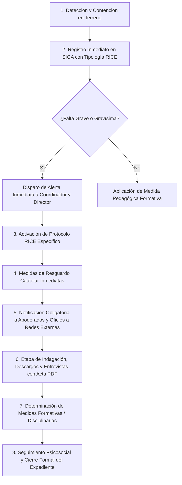

# GUÍA MAESTRA DE DEFENSA: MODELO DE NEGOCIO, MERCADO Y DOMINIO ESCOLAR
## Proyecto: SIGA Escolar (Sistema de Gestión y Acompañamiento Escolar)
### Caso de Aplicación Real: Escuela Coeducacional N°1 El Salvador (Atacama, Chile)

---

## 1. RESUMEN EJECUTIVO: LA PERSPECTIVA DE NEGOCIO

En una defensa de titulación o evaluación de proyecto de software, la comisión evaluadora busca certificar que los graduados no son únicamente programadores de código, sino **Ingenieros de Software que comprenden el modelo de negocio, el entorno regulatorio, la dinámica operativa y el dolor financiero/legal del cliente**.

> **Definición Estratégica del Negocio:**  
> SIGA Escolar es una solución **Vertical Especializada (*Best-of-Breed*) EdTech B2B/B2G** diseñada para digitalizar, estructurar y blindar legalmente el ciclo de vida de la convivencia escolar y el cumplimiento normativo en establecimientos educacionales de Chile, transformando una gestión manual punitiva y en papel en un ecosistema formativo, predictivo y auditable.

---

## 2. EL CLIENTE Y EL CASO DE ESTUDIO REAL

### 2.1. Ficha Técnica del Establecimiento
* **Nombre de la Institución:** Escuela Coeducacional N°1 El Salvador.
* **Ubicación Geográfica:** Campamento Minero El Salvador, Comuna de Diego de Almagro, Región de Atacama (zona de influencia directa de Codelco División Salvador).
* **Dependencia Administrativa:** **Pública** — Dependiente del **SLEP Atacama** (Servicio Local de Educación Pública, Ley N° 21.040 de Nueva Educación Pública).
* **Población Escolar:** **483 estudiantes matriculados**, desde Educación Parvularia (Prekínder y Kínder) hasta Educación Básica/Media.
* **Régimen Horario:** Dos jornadas lectivas continuas (mañana y tarde).
* **Equipo Profesional:** Cuerpo docente de aula, profesores jefes, asistentes de la educación, inspectores de patio y un equipo psicosocial especializado (Dupla Psicosocial / Encargado de Inclusión y PIE - Programa de Integración Escolar).

### 2.2. Métricas y Volumen Operacional Real (El "Dolor Operacional")
Antes de la llegada de SIGA Escolar, el diagnóstico institucional arrojó las siguientes cifras críticas:
* **Volumen de Incidentes Semanales:** Entre **25 y 35 incidentes semanales** registrados en terreno (~1.200 a 1.400 eventos por año escolar) que debían ser tipificados, atendidos y documentados.
* **Tiempo de Redacción Manual:** Un profesional de convivencia o inspector demoraba un promedio de **20 minutos por caso** en transcribir del cuaderno borrador a Word, imprimir el acta física y archivarla. Con SIGA Escolar, el tiempo de emisión de actas y reportes oficiales se redujo a **menos de 3 minutos** (ahorro superior al 65% del tiempo administrativo).
* **Pérdida de Trazabilidad:** Al manejarse en cuadernos físicos y planillas Excel locales descentralizadas, el **40% de los incidentes leves reiterados no eran detectados como patrones de bullying temprano**, explosionando semanas después en faltas graves o agresiones físicas.
* **Riesgo Legal Inminente:** Retrasos en la notificación a apoderados y pérdida de carpetas físicas ponían a la escuela en riesgo permanente de multas ante la Superintendencia de Educación por faltas al debido proceso.

---

## 3. MAPEO DETALLADO DE STAKEHOLDERS (MATRIZ DE IMPACTO)

En un colegio, el software interactúa con diferentes perfiles con intereses y dolores disímiles:

| Stakeholder / Actor Clave | Rol Organizacional | Dolor / Preocupación Principal | Valor Entregado por SIGA Escolar |
| :--- | :--- | :--- | :--- |
| **Rodrigo Pacheco Contreras** | **Director del Establecimiento** (Máxima autoridad legal) | Multas de la Superintendencia, demandas de apoderados, pérdida de subvención escolar y daño a la reputación institucional. | Dashboard ejecutivo con macroindicadores en tiempo real, trazabilidad 100% auditable y resguardo legal ante fiscalizaciones. |
| **Roberto Eduardo Miranda Vivanco** | **Coordinador de Convivencia Escolar** (SME / Cliente Directo) | Sobrecarga burocrática (70% del tiempo llenando papeles), descontrol de plazos fatales (<48h) e inseguridad en la redacción técnica de informes. | Tablero Kanban de protocolos RICE, semáforos de plazos legales de vencimiento, asistente de actas estructuradas y buscador semántico de antecedentes. |
| **Inspectoría General** | Unidad Directiva Disciplinaria | Falta de consolidación de faltas, libros de novedades saturados y dificultad para citar apoderados con evidencia irrefutable. | Consolidación cronológica inmediata del historial del alumno, citación formal con actas PDF y alertas en incidentes graves/gravísimos. |
| **Cuerpo de Inspectores de Patio** | Operadores de Primera Línea en Terreno | No pueden andar con computadores pesados en el recreo; necesitan registrar la pelea o la falta en menos de 2 minutos. | Interfaz móvil (*Mobile-First*) optimizada para smartphones, con selectores en cascada rápidos y tipología estandarizada. |
| **Dupla Psicosocial** (Psicólogo/a y Trabajador/a Social) | Unidad Psicosocial y Derivación a Redes | Filtración de diagnósticos íntimos y antecedentes de vulneración intrafamiliar a personal no autorizado. | Expediente psicosocial protegido con RBAC estricto, aislamiento de datos sensibles, anonimización DLP (Ley N° 21.719) y seguimiento de redes externas. |
| **Cuerpo Docente** (Profesores Jefes y de Aula) | Unidad Pedagógica | Desconocimiento del contexto emocional/conductual de sus alumnos al entrar a la sala; entrevistas tensas con apoderados sin respaldo. | Ficha individual del estudiante con historial objetivo de medidas formativas previas y generación automática de actas de entrevista. |
| **Sostenedor / SLEP Atacama** | Entidad Administradora y Financiera | Rendición de cuentas de fondos públicos, optimización de recursos y estandarización de procesos en los colegios de la red. | Arquitectura multi-tenant lista para escalar a los 60 establecimientos del territorio con costo cero de licenciamiento (\$0 CLP). |
| **Estudiantes y Apoderados** | Comunidad Escolar (Sujetos de Derecho) | Sensación de injusticia, arbitrariedad en castigos, desprotección ante el bullying y vulneración de su intimidad. | Garantía del Debido Proceso escolar, enfoque formativo-restaurativo y máxima protección de datos personales. |
| **Redes Externas** (Tribunales de Familia, Fiscalía, OLN, CESFAM) | Organismos Receptores Judiciales y de Salud | Oficios mal redactados, falta de evidencia objetiva y retraso en derivaciones urgentes de protección de menores. | Expedientes probatorios estructurados en PDF con membrete institucional, cronología exacta y registros de firmas. |

---

## 4. EL MERCADO EDUCATIVO EN CHILE (ESTRUCTURA Y CIFRAS)

Cuando la comisión pregunte por el mercado y viabilidad económica del producto:

### 4.1. Tamaño del Universo Escolar en Chile
* **Universo Total Nacional:** Existen aproximadamente **11.500 a 11.800 establecimientos escolares** reconocidos oficialmente por el Ministerio de Educación (MINEDUC) en Chile.
* **Composición por Dependencia:**
  1. **Sector Público (SLEP y Municipales):** Representa cerca del **43% a 45%** de los establecimientos (~5.000 colegios). En plena transición a los Servicios Locales de Educación Pública (Ley N° 21.040).
  2. **Sector Particular Subvencionado:** Representa cerca del **48% a 49%** de los colegios (~5.600 establecimientos), pero atiende a más del **54% de la matrícula escolar nacional**. Son administrados por corporaciones o fundaciones privadas sin fines de lucro.
  3. **Sector Particular Pagado:** Representa entre el **7% y 8%** del mercado (~800 a 900 colegios de élite).

### 4.2. Tipología de Mercado: B2B y B2G
* **B2B (Business-to-Business):** Venta directa a Fundaciones y Corporaciones Educacionales que gestionan redes de colegios particulares subvencionados y pagados.
* **B2G (Business-to-Government):** Venta institucional a Direcciones de Educación Municipal (DAEM), Corporaciones Municipales y **Servicios Locales de Educación Pública (SLEP)** mediante licitaciones en Mercado Público o Convenio Marco.

### 4.3. Dimensionamiento del Mercado (TAM / SAM / SOM)
* **TAM (Total Addressable Market - Mercado Total):** Los **11.600 colegios de Chile**. Todo colegio por ley está obligado a llevar un RICE y gestionar incidentes de violencia escolar.
* **SAM (Serviceable Available Market - Mercado Disponible):** Los **~10.600 colegios públicos y particulares subvencionados** que operan bajo el sistema de fiscalización estricta de la Superintendencia de Educación y que disponen de financiamiento público vía Ley SEP.
* **SOM (Serviceable Obtainable Market - Mercado Objetivo Inicial):** Los **60 establecimientos educacionales dependientes del SLEP Atacama** (zona geográfica de despliegue inicial de la Escuela El Salvador), con una meta de penetración inmediata del 15% (9 establecimientos en el año 1).

### 4.4. Modelo de Financiamiento: ¿Cómo paga el colegio este software?
Un colegio no gasta "de su bolsillo" privado. En Chile, la adquisición de plataformas de software para convivencia escolar se financia mediante:
* **Recursos de la Ley SEP (Ley N° 20.248 - Subvención Escolar Preferencial):**
  * Los fondos SEP están expresamente autorizados por la normativa ministerial para destinarse a iniciativas del **PME (Plan de Mejoramiento Educativo)**, específicamente en la dimensión estratégica de **Convivencia Escolar**.
  * Comprar una licencia o suscripción SaaS para convivencia escolar es 100% rendible y aceptado por la Superintendencia de Educación en las rendiciones de cuentas anuales.

---

## 5. MARCO LEGAL Y REGULATORIO CHILENO: POR QUÉ EXISTE SIGA

El colegio no adquiere SIGA Escolar por mero capricho tecnológico; **lo adquiere para no ser multado ni clausurado por el Estado chileno**.

### 5.1. Ley N° 20.536 sobre Violencia Escolar (2011)
* Establece que la convivencia escolar es un derecho de todos los miembros de la comunidad educativa.
* **Obligaciones Legales Taxativas:**
  1. Todo establecimiento **debe** contar con un Consejo Escolar o Comité de Buena Convivencia Escolar.
  2. Todo establecimiento **debe** designar a un **Encargado de Convivencia Escolar (ECE)** profesional.
  3. Todo establecimiento **debe** contar con un **Reglamento Interno que regule las relaciones escolares y tipifique las faltas y sanciones**.

### 5.2. Resolución Exenta N° 781 de la Superintendencia de Educación
* Es la **norma técnica rectora**. Aprueba la circular oficial que imparte instrucciones sobre Reglamentos Internos de los establecimientos educacionales de enseñanza parvularia, básica y media.
* Exige que los reglamentos contengan **protocolos de actuación estructurados paso a paso**, garantizando:
  * El principio de legalidad y tipicidad de las faltas.
  * El **Debido Proceso** escolar (derecho a ser escuchado, presunción de inocencia, derecho a presentar descargos y derecho a apelación).
  * La proporcionalidad y carácter formativo de las sanciones (prohibición de castigos corporales, humillantes o degradantes).

### 5.3. El Poder Sancionatorio de la Superintendencia de Educación
* Ante una denuncia de un apoderado (por bullying, agresión o discriminación), la Superintendencia abre un proceso administrativo sancionatorio al colegio y exige la presentación de la **carpeta probatoria completa**.
* **Sanciones aplicables al colegio (art. 73 Ley N° 20.529):**
  1. Amonestación por escrito.
  2. **Multas en dinero a beneficio fiscal de hasta 1.000 UTM** (a septiembre de 2026, equivalentes a más de **\$67.000.000 de pesos chilenos**).
  3. Retención o privación temporal o definitiva de la subvención estatal.
  4. Inhabilitación temporal o perpetua de los sostenedores y directivos.
  5. **Revocación del Reconocimiento Oficial** (cierre forzado del colegio).
* **Impacto SIGA:** Permite generar el expediente digital foliado en PDF en segundos, demostrando que el colegio actuó en tiempo y forma, salvando al establecimiento de multas millonarias.

### 5.4. Artículo 175 letra e) del Código Procesal Penal (Plazo Fatal de 24 Horas)
* Los directores, inspectores y profesores tienen la **obligación penal de denunciar en un plazo perentorio de 24 horas** todo hecho que revista caracteres de delito acontecido en el colegio (abusos sexuales, porte de armas de fuego o cortopunzantes, microtráfico de drogas o lesiones graves) ante Carabineros, PDI o Fiscalía.
* **Consecuencia:** La omisión de denuncia constituye un delito penado por ley para los funcionarios públicos y docentes. SIGA Escolar emite alertas de semáforo crítico y notificaciones automáticas inmediatas a Dirección en incidentes gravísimos.

### 5.5. Ley N° 21.128 ("Aula Segura")
* Faculta al Director a aplicar la medida cautelar de suspensión inmediata del estudiante y abrir un procedimiento expedito de expulsión o cancelación de matrícula frente a actos graves que atenten contra la integridad física de la comunidad escolar (armas, agresiones graves al personal o artefactos incendiarios), respetando siempre un plazo breve de 10 días para descargos y resolución fundada.

### 5.6. Ley N° 19.628 y Nueva Ley N° 21.719 (Protección de Datos Personales de Menores)
* La información disciplinaria, psicológica, médica y de pertenencia al PIE de un estudiante menor de edad tiene el carácter legal de **Datos Sensibles**.
* Queda estrictamente prohibido divulgar, publicar o almacenar sin custodia estos antecedentes.
* **Impacto en SIGA:** Se implementó una arquitectura de **Privacidad por Diseño (DLP - Data Loss Prevention)**: antes de interactuar con modelos de IA en la nube (Google Gemini Flash), el sistema anonimiza automáticamente nombres y RUTs, garantizando que ningún dato identificable de los niños salga de la base de datos nacional.

---

## 6. EL RICE DE LA ESCUELA Y SUS 10 PROTOCOLOS NORMATIVOS

**RICE** son las siglas de **Reglamento Interno y de Convivencia Escolar**. Es el marco regulatorio vinculante de la Escuela El Salvador.

### Los 10 Protocolos Normativos Digitalizados en SIGA Escolar:
1. **Protocolo N° 1: Maltrato Escolar, Bullying y Ciberacoso entre Estudiantes.**  
   *Abordaje de agresiones sistemáticas, intimidación física, verbal o virtual.*
2. **Protocolo N° 2: Maltrato o Agresión de un Adulto a un Estudiante.**  
   *Denuncias contra docentes o asistentes; suspensión de funciones preventivas y separación de ambientes.*
3. **Protocolo N° 3: Agresión de Estudiantes hacia Docentes o Asistentes de la Educación.**  
   *Protección laboral de los funcionarios, aplicación de medidas de contención y activación de Ley Aula Segura si procede.*
4. **Protocolo N° 4: Acoso Sexual, Abuso Sexual o Vulneración de la Indemnidad Sexual.**  
   *Protocolo de máxima reserva, contención psicosocial inmediata, prohibición de careos o revictimización, y derivación penal obligatoria en <24 horas a Fiscalía o Carabineros.*
5. **Protocolo N° 5: Porte, Tenencia, Consumo o Tráfico de Alcohol y Sustancias Ilícitas.**  
   *Retiro seguro de la sustancia con testigos, citación urgente a apoderados y derivación a programas preventivos SENDA / salud pública.*
6. **Protocolo N° 6: Porte o Tenencia de Armas u Objetos Peligrosos.**  
   *Aislamiento preventivo, decomiso bajo acta con resguardo físico, denuncia policial inmediata y medida cautelar de seguridad.*
7. **Protocolo N° 7: Detección de Vulneración de Derechos de Niños, Niñas y Adolescentes (NNA).**  
   *Detección de negligencia parental severa, maltrato intrafamiliar o trabajo infantil; derivación a la Oficina Local de la Niñez (OLN) y Tribunales de Familia.*
8. **Protocolo N° 8: Ideación Suicida, Intentos de Autoagresión o Descompensaciones de Salud Mental.**  
   *Primeros auxilios psicológicos, acompañamiento presencial continuo, entrega formal al apoderado y derivación urgente al CESFAM o COSAM territorial.*
9. **Protocolo N° 9: Accidentes Escolares (Decreto Supremo N° 313).**  
   *Primeros auxilios básicos, llenado de la Declaración Individual de Accidente Escolar y traslado asistido al centro asistencial de salud.*
10. **Protocolo N° 10: Retención y Apoyo a Estudiantes Embarazadas, Madres y Padres Adolescentes.**  
    *Adecuaciones curriculares, facilidades de horario para controles médicos y lactancia materna, prohibiendo cualquier forma de discriminación.*

### El Flujo de Vida Estandarizado de un Caso en SIGA:

---

## 7. EL PANORAMA COMPETITIVO Y EL "MOAT" (DEFENSA DEL VALOR)

Si el profesor pregunta: *«¿Por qué hacer este software si ya existen Lirmi, WebClass o Colegium?»*:

| Criterio de Comparación | ERPs Tradicionales (Lirmi, WebClass, Colegium) | SIGA Escolar |
| :--- | :--- | :--- |
| **Foco de Negocio Principal** | **Libro de Clases Digital**, notas, asistencia curricular y rendición de subvención general al SIGE del MINEDUC. | **Gestión Vertical Profunda (*Best-of-Breed*)** en Convivencia Escolar, RICE y Clima de Aula. |
| **Tratamiento de la Convivencia** | Módulo secundario y periférico; un simple campo de texto libre para "anotaciones negativas" en la hoja de vida. | Flujo de procesos riguroso con los 10 protocolos normativos de la Resolución Exenta N° 781 de la Supereduc. |
| **Enfoque Pedagógico** | **Punitivo / Punitivista**: acumulación de anotaciones negativas para justificar suspensiones. | **Formativo y Restaurativo**: planes de mediación, medidas reparatorias y acuerdos pedagógicos. |
| **Control de Plazos Legales** | Inexistente. El usuario debe acordarse manualmente de los plazos. | **Semáforos Temporales Automatizados** (<48h, alertas de vencimiento normativo). |
| **Inteligencia Artificial Aplicada** | Ninguna o chatbots genéricos desconectados de la regulación chilena. | **Agente Predictivo y Asistente Normativo (Google Gemini Flash)** con filtro de privacidad DLP para menores. |
| **Costo de Licenciamiento** | Elevado costo recurrente por alumno matriculado (\$3.000 a \$8.000 CLP mensuales por estudiante). | **Costo de licenciamiento \$0 CLP** gracias al stack Open Source y arquitectura Serverless. |

---

## 8. PREGUNTAS TRAMPA DE LA COMISIÓN Y CÓMO RESPONDERLAS

### Pregunta 1: «¿Cómo se financia esto en un colegio público vulnerable como el de El Salvador si no tienen presupuesto?»
> **Respuesta Maestra:**  
> *"Profesor, los colegios públicos y particulares subvencionados no financian este tipo de herramientas con su gasto operativo común, sino con los fondos de la **Ley SEP (Subvención Escolar Preferencial, Ley 20.248)**. La normativa ministerial y la Superintendencia de Educación exigen que las escuelas elaboren anualmente su **PME (Plan de Mejoramiento Educativo)**, el cual cuenta con un área estratégica prioritaria y obligatoria denominada **Convivencia Escolar**. La contratación de plataformas de software para optimizar la convivencia y el seguimiento de los estudiantes es un ítem 100% elegible y rendible ante la Superintendencia con fondos SEP."*

---

### Pregunta 2: «¿Por qué decidieron hacer un sistema aparte en lugar de usar el módulo de convivencia de Lirmi o WebClass?»
> **Respuesta Maestra:**  
> *"Porque plataformas como Lirmi o WebClass son **ERPs generalistas** centrados en el libro de clases digital y la asistencia para el pago de la subvención. Su abordaje de la convivencia es cosmético: se limita a registrar 'anotaciones negativas' en un texto plano. No modelan los 10 protocolos normativos de la Resolución Exenta N° 781 de la Superintendencia, no controlan los plazos fatales de 24 horas del Código Procesal Penal, no ofrecen seguimiento por etapas ni protegen los datos psicosociales con la rigurosidad que exige la nueva Ley 21.719 de datos de menores. SIGA Escolar es una solución de **especialización vertical (*Best-of-Breed*)** diseñada a la medida del marco legal chileno."*

---

### Pregunta 3: «¿Qué pasa si un colegio privado de Santiago quiere usar SIGA Escolar? ¿El sistema está acoplado solo a El Salvador?»
> **Respuesta Maestra:**  
> *"La arquitectura de SIGA Escolar fue concebida desde el día uno bajo un patrón **Multi-Tenant Nativo**. Cada tabla de la base de datos PostgreSQL en Supabase incorpora la clave de particionamiento lógico `tenant_id` vinculada a políticas estrictas de **Row Level Security (RLS)** a nivel de base de datos. Esto significa que podemos incorporar al Colegio N°2, al SLEP Atacama completo o a una red de colegios privados sin modificar una sola línea de código backend, garantizando que jamás existirá fuga o contaminación cruzada de datos entre distintos colegios."*

---

### Pregunta 4: «¿Cómo protegen la privacidad de los menores si usan Inteligencia Artificial de Google?»
> **Respuesta Maestra:**  
> *"Cumplimos con el principio de **Privacidad por Diseño (*Privacy by Design*)** y las exigencias de la Ley N° 19.628 y Ley N° 21.719 sobre protección de datos de menores. Nuestro backend implementa un pipeline de **DLP (Data Loss Prevention)** que sanitiza el texto antes de enviarlo a la API de Google Gemini Flash. Todos los RUTs, nombres de estudiantes, números de contacto y referencias de identidad directa son enmascarados y sustituidos por tokens semánticos (por ejemplo, `[Estudiante 1 - Agredido]`). La IA analiza únicamente el hecho fáctico objetivo y devuelve la estructura legal del reporte; los datos personales reales solo se reinyectan localmente en memoria al momento de compilar el PDF definitivo para las firmas institucionales."*

---

### Pregunta 5: «¿La Inteligencia Artificial puede tomar decisiones de expulsión o sancionar a un alumno automáticamente?»
> **Respuesta Maestra:**  
> *"Bajo ninguna circunstancia, profesor. SIGA Escolar opera bajo el principio de **Inteligencia Artificial Human-in-the-Loop (Humano al Centro)** y el mandato de la **Resolución Exenta N° 781**, la cual prohíbe cualquier sanción automatizada o que prescinda del debido proceso. Nuestro motor predictivo y asistente no sanciona: formula sugerencias preventivas y borradores técnicos que deben ser obligatoriamente revisados, validados y firmados por el Encargado de Convivencia Escolar o el Director del establecimiento. La tecnología asiste al profesional; la deliberación pedagógica y ética permanece siempre en el ser humano."*

---

## 9. CHECKLIST RÁPIDO PARA MEMORIZAR ANTES DE ENTRAR A LA DEFENSA

- [ ] **483 alumnos** en la Escuela Coeducacional N°1 El Salvador.
- [ ] **~30 casos por semana** en terreno (~1.300 incidentes/año).
- [ ] **20 minutos a 3 minutos** (ahorro del 65% en redacción de actas).
- [ ] **11.600 colegios** en Chile (TAM).
- [ ] **10 protocolos RICE** normativos de la Superintendencia (Res. Exenta 781).
- [ ] **Multas de hasta 1.000 UTM** (> \$65.000.000 CLP) que previene el sistema.
- [ ] **Plazo legal fatal de 24 horas** para denunciar delitos (Art. 175 letra e) CPP).
- [ ] **Ley SEP (Subvención Escolar Preferencial)** como fuente de financiamiento en el PME.
- [ ] **DLP y Ley N° 21.719**: Cero datos personales de niños enviados a servidores de IA.
- [ ] **Multi-tenant con RLS**: Aislamiento estricto por `tenant_id` en Supabase.
