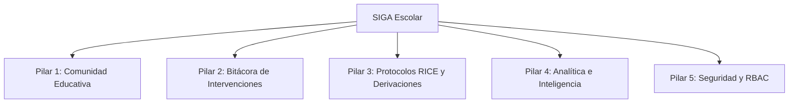

# REQUERIMIENTOS CONSOLIDADOS DEL SISTEMA (SRS)
## Sistema de Gestión y Acompañamiento Escolar (SIGA Escolar)

**Cliente Institucional:** Escuela Coeducacional N° 1 El Salvador, Región de Atacama, Chile  
**Entidad Académica:** Universidad Tecnológica de Chile INACAP  
**Estándar de Especificación:** IEEE 830 / Marco Ágil Scrum  
**Versión:** 2.0 (Consolidada de Entrevistas y Validación en Terreno)  
**Fecha:** Septiembre 2026  

---

## 1. INTRODUCCIÓN Y CONTEXTO INSTITUCIONAL

### 1.1 Propósito
El presente documento consolida la totalidad del levantamiento de requerimientos, elicitación con usuarios clave, entrevistas en terreno y especificaciones formales para el desarrollo e implementación del software **SIGA Escolar** en la **Escuela Coeducacional N° 1 El Salvador**.

### 1.2 Patrocinio y Validación Directiva
El proceso de levantamiento contó con el respaldo formal de las autoridades del establecimiento:
* **Director del Establecimiento:** Rodrigo Pacheco Contreras (compromiso de patrocinio institucional y convenios de colaboración académica).
* **Coordinador de Convivencia Escolar:** Roberto Miranda Vivanco (interlocutor técnico y sponsor operativo del sistema).

### 1.3 Problemática Detectada y Justificación
La escuela atiende una matrícula de **483 estudiantes** distribuidos desde Educación Parvularia hasta Enseñanza Media. Históricamente, la gestión de convivencia escolar se realizaba mediante bitácoras en papel, carpetas archivadoras dispersas y planillas de cálculo locales, generando:
1. **Riesgo crítico de pérdida o alteración de antecedentes sensibles** de menores de edad.
2. **Dificultad para cumplir con los plazos fatales perentorios** exigidos por la Superintendencia de Educación en protocolos normativos RICE.
3. **Sobrecarga administrativa severa:** Redacción manual repetitiva de actas y citaciones (promedio de 20 minutos por caso).
4. **Falta de visibilidad directiva:** Imposibilidad de detectar reincidencias tempranas antes de que una falta leve escale a violencia o deserción.

---

## 2. PILARES FUNCIONALES FUNDAMENTALES

### Pilar 1: Gestión Integral de la Comunidad Educativa
* **Estudiantes y Cursos:** Estructura jerárquica organizada por Nivel (Pre-Kínder a 4° Medio) y Letra (A, B, C), asignados a su respectivo Profesor Jefe. Fichas de estudiantes con RUT (validación Módulo 11), antecedentes de salud, apoderados y marca de pertenencia al Programa de Integración Escolar (PIE).
* **Red de Apoderados:** Directorio de apoderados titulares y suplentes con parentesco y datos de contacto de emergencia actualizados.
* **Funcionarios:** Directorio de personal docente, directivo, paradocente y asistentes de la educación.

### Pilar 2: Bitácora de Intervenciones y Casos (Mobile-First)
Diseñada para un registro rápido y compatible con dispositivos móviles en terreno:
* **Tipología de Abordajes con Estudiantes y Apoderados:**
  1. *Indagación y denuncias:* Registro de hechos, participantes y recepción formal de reclamos.
  2. *Conflictos puntuales / Incidentes:* Hechos aislados entre pares en patio o sala.
  3. *Contención emocional:* Espacios de contención frente a desregulaciones, crisis de llanto o angustia.
  4. *Mediación escolar:* Acuerdos guiados y compromisos formativos entre las partes.
* **Tipología de Abordajes con Funcionarios:** Entrevistas de contención, indagaciones internas, entrega formal de información y mediación de conflictos laborales.

### Pilar 3: Flujos Normativos RICE y Redes de Derivación Externa
Digitalización estricta de las actuaciones requeridas por la Superintendencia de Educación:

#### Catálogo Oficial de Protocolos RICE (10 Protocolos)
1. **Maltrato, acoso escolar o violencia (*Bullying* y *Ciberbullying*)**
2. **Agresiones sexuales y hechos de connotación sexual**
3. **Vulneración de derechos de niños, niñas y adolescentes**
4. **Consumo, porte o tráfico de alcohol y drogas (Ley N° 20.000)**
5. **Señales de depresión, ideación suicida y autolesiones**
6. **Salidas pedagógicas y giras de estudio**
7. **Accidentes escolares (Seguro Escolar D.S. N° 313)**
8. **Retención escolar de estudiantes embarazadas, madres y padres adolescentes**
9. **Reconocimiento de identidad de género (estudiantes Trans / Circular 812)**
10. **Desregulaciones emocionales y conductuales severas**

#### Catálogo de Redes de Apoyo y Derivación Externa (10 Entidades)
* **Salud:** CESFAM / Consultorio General, COSAM (Centro Comunitario de Salud Mental).
* **Protección y Niñez:** OLN (Oficina Local de la Niñez), Servicio Mejor Niñez (ex SENAME).
* **Justicia y Orden:** Fiscalía (Ministerio Público), Tribunales de Familia, Carabineros de Chile, Policía de Investigaciones (PDI).
* **Programas de Apoyo:** Habilidades para la Vida (JUNAEB), SENDA Previene, PIE institucional.

### Pilar 4: Panel Estadístico y Soporte a la Toma de Decisiones
* **Ficha Individual (Dashboard por Estudiante):** Gráficos de tendencias conductuales (proporción entre mediaciones, incidentes y contención) disponibles de forma inmediata para fundamentar entrevistas con apoderados con evidencia objetiva.
* **Monitoreo Grupal por Curso y Nivel:** Identificación de focos de conflicto en aulas específicas para guiar intervenciones pedagógicas grupales.
* **Evaluación de Impacto Institucional:** Curvas temporales para medir si los planes de prevención logran disminuir la tasa de activación de protocolos graves a lo largo de los semestres.

### Pilar 5: Seguridad, Privacidad y Roles de Acceso (RBAC)
* Aislamiento multi-tenant estricto mediante Row Level Security (RLS) en PostgreSQL.
* Matriz de permisos jerárquica con 5 roles escolares autorizados.
* Bitácora invisible de auditoría de todas las operaciones CRUD.

### Pilar 6: Inteligencia Artificial Generativa y Predictiva (Evolución Post-MVP)
* **Asistente de Redacción Normativa Asistida (Google Gemini Flash):** Generación automática de propuestas estructuradas de informes de incidentes en formato JSON, con sanitización previa de datos personales (DLP) y revisión obligatoria *Human-in-the-Loop*.
* **Agente de Inteligencia Predictiva y Soluciones Preventivas:** Motor de análisis de tendencias longitudinales que correlaciona antecedentes, pertenencia al PIE y recurrencia temporal para anticipar escaladas de conflicto y sugerir planes de intervención psicosocial formativos.

---

## 3. FRICCIÓN OPERATIVA EN TERRENO Y SOLUCIONES DE DISEÑO (TOMA DE REQUERIMIENTOS 2)

A partir de la elicitación directa con el equipo de convivencia escolar, se mapearon los dolores cotidianos y la solución implementada en SIGA Escolar:

| Problema Identificado en Terreno | Causa Raíz | Solución Implementada en SIGA Escolar |
| :--- | :--- | :--- |
| **Pérdida de tiempo en contingencias y búsqueda de antecedentes.** | La información de un alumno está dispersa en múltiples cuadernos y carpetas. | **Ficha Unificada del Estudiante:** Historial cronológico consolidado accesible en menos de 5 segundos. |
| **Inseguridad y sobrecarga al redactar actas y reportes.** | Redacción manual repetitiva (demora 20 minutos por caso). | **Generador Automático de Borradores de Reportes:** Prellenado automático con identificación, motivo, relato y acuerdos; el funcionario solo revisa y oficializa (tiempo reducido a 3 minutos). |
| **Dificultad para controlar plazos legales y normativos.** | Se gestionan por memoria, notas adhesivas o mensajes informales de WhatsApp. | **Bandeja de Entrada Inteligente Matutina:** Panel que lista los casos ordenados por urgencia de vencimiento normativo (hoy, próximos, atrasados). |
| **Falta de guía en casos complejos.** | Inseguridad técnica al momento de oficializar denuncias o aplicar sanciones. | **Checklist Normativo RICE Paso a Paso:** Flujo interactivo que indica requisitos legales obligatorios cumplidos y pendientes según la Superintendencia. |
| **Dificultad para detectar reincidencias tempranas.** | Casos leves dispersos no permiten notar el patrón acumulativo. | **Motor de Alertas Preventivas:** Detección automática de patrones (ej. *"Este estudiante registra 3 incidentes en los últimos 45 días; evaluar protocolo de acoso escolar"*). Sugiere análisis formativo profesional. |
| **Enfoque reactivo del abordaje escolar.** | Se interviene únicamente cuando el incidente ya ocurrió o escaló a violencia. | **Agente Preventivo y Predictivo con IA:** Anticipación de focos de conflicto y propuesta de planes de mediación formativos para la Dupla Psicosocial. |

---

## 4. MATRIZ FORMAL DE REQUERIMIENTOS DEL SISTEMA

### 4.1 Requerimientos Funcionales (RF)

| Código | Nombre del Requerimiento | Descripción Técnica | Prioridad | Estado |
| :--- | :--- | :--- | :---: | :---: |
| **RF-01** | Autenticación y Seguridad de Acceso | Autenticación vía JWT (expiración 8h), contraseñas con bcrypt (coste 10), protección contra fuerza bruta (bloqueo por 15 min tras 5 intentos fallidos). | Crítica | Implementado (MVP) |
| **RF-02** | Control de Acceso por Roles (RBAC) | Permisos diferenciados para 5 roles: `ADMINISTRADOR`, `DIRECTIVO`, `EQUIPO_FORMACION`, `INSPECTOR`, `DOCENTE`. | Crítica | Implementado (MVP) |
| **RF-03** | Bitácora de Auditoría Invisible | Registro inmutable en formato JSONB de toda operación de creación, edición o eliminación de registros, incluyendo IP, user-agent y usuario responsable. | Alta | Implementado (MVP) |
| **RF-04** | Gestión de Usuarios del Establecimiento | CRUD de usuarios con validación de estado activo y salvaguarda contra la eliminación del último administrador activo. | Alta | Implementado (MVP) |
| **RF-05** | Ficha del Estudiante e Importación Masiva | Perfil integral con historial conductual, importador masivo vía CSV con validación de RUT chileno (Módulo 11) y marca PIE. | Alta | Implementado (MVP) |
| **RF-06** | Registro de Incidentes Escolares | Formulario con selector en cascada (Nivel $\rightarrow$ Letra $\rightarrow$ Alumnos), 7 tipos de abordaje, niveles de gravedad (Leve, Grave, Gravísimo) y múltiples involucrados. | Crítica | Implementado (MVP) |
| **RF-07** | Alertas Tempranas de Casos Críticos | Generación y visualización inmediata de alertas ante incidentes Graves y Gravísimos con escalamiento visual en el Dashboard. | Alta | Implementado (MVP) |
| **RF-08** | Activación de Protocolos RICE | Creación guiada de protocolos normativos vinculados a incidentes, con validación de pertenencia de estudiantes. | Crítica | Implementado (MVP) |
| **RF-09** | Checklist y Trazabilidad RICE | Checklist interactivo por pasos normativos, con observaciones obligatorias para transiciones de estado (`EN_PROCESO`, `CERRADO`, etc.). | Alta | Implementado (MVP) |
| **RF-10** | Dashboard Analítico en Tiempo Real | Visualización gráfica interactiva (Recharts): distribución por abordaje (Donut Chart), recurrencia mensual y semáforo de urgencia de protocolos. | Media | Implementado (MVP) |
| **RF-11** | Emisión de Historial en PDF | Exportación de fichas conductuales en PDF con membrete institucional, firmas de responsabilidad y fecha de emisión. | Media | Implementado (MVP) |
| **RF-12** | Asistente de Redacción de Informes con IA | Generación asistida de propuestas de informe de incidente mediante Google Gemini Flash en formato JSON estructurado (contexto, hechos objetivos, medidas, acuerdos y seguimiento). | Alta | Fase Evolutiva (Sprint 6) |
| **RF-13** | Revisión Modular y Human-in-the-Loop | Interfaz modal interactiva para edición independiente de secciones del informe, regeneración controlada y guardado de borradores antes de la aprobación final. | Alta | Fase Evolutiva (Sprint 6) |
| **RF-14** | Oficialización y Emisión de Reporte PDF | Generación de informe PDF oficial con membrete del colegio, código de verificación, fecha de aprobación y bloques de firma para Coordinación y Dirección. | Alta | Fase Evolutiva (Sprint 6) |
| **RF-15** | Motor Predictivo de Riesgo de Convivencia | Algoritmo de detección preventiva que correlaciona recurrencia temporal, severidad de faltas, factores de inclusión (PIE) y cambios en patrones de conducta para estimar riesgo de escalada. | Alta | Fase Evolutiva (Sprint 7) |
| **RF-16** | Generador de Planes de Acción Preventivos | Agente inteligente con Google Gemini Flash que formula recomendaciones formativas personalizadas (talleres de aula, mediación restaurativa, derivación temprana a redes). | Alta | Fase Evolutiva (Sprint 7) |
| **RF-17** | Monitoreo de Efectividad Preventiva | Métricas de seguimiento para evaluar si las intervenciones formativas y acuerdos restaurativos redujeron efectivamente el índice de riesgo conductual del estudiante. | Media | Fase Evolutiva (Sprint 7) |

### 4.2 Requerimientos No Funcionales (RNF)

| Código | Requerimiento | Métrica o Estándar de Cumplimiento |
| :--- | :--- | :--- |
| **RNF-01** | **Multi-Tenancy y Aislamiento** | Políticas Row Level Security (RLS) en Supabase/PostgreSQL. Cada consulta se filtra obligatoriamente por `tenant_id`. |
| **RNF-02** | **Tiempo de Respuesta** | Respuestas de API inferiores a 300 ms en operaciones estándar y menores a 100 ms en búsquedas en cascada e índices. |
| **RNF-03** | **Seguridad en Tránsito y Reposo** | Encriptación TLS 1.3 (HTTPS) en frontend y backend; hash bcrypt para credenciales y tokens JWT firmados criptográficamente. |
| **RNF-04** | **Disponibilidad** | 99.5% de tiempo de actividad en entornos PaaS de producción (Vercel para frontend, Render para backend, Supabase para persistencia). |
| **RNF-05** | **Soporte Offline y PWA** | Arquitectura Progressive Web App con service worker, precacheo de vistas críticas y cola de sincronización diferida (`offlineQueue`). |
| **RNF-06** | **Accesibilidad (a11y)** | Cumplimiento de directrices WCAG 2.1 nivel AA: contrastes legibles, navegación completa por teclado, atributos ARIA y etiquetas explícitas. |
| **RNF-07** | **Diseño Responsivo** | Interfaz adaptativa *Mobile-First* operable fluidamente desde pantallas de 360 px hasta monitores 4K. |
| **RNF-08** | **Mantenibilidad y Cobertura** | Cobertura mínima de pruebas unitarias superior al 80-90% en lógica de negocio crítica y componentes visuales principales. |
| **RNF-09** | **Privacidad en IA y DLP Escolar** | Anonimización y sanitización estricta de PII (RUTs, nombres, domicilios) antes de enviar prompts a la API de Gemini (Ley N° 19.628). |
| **RNF-10** | **Latencia y Eficiencia en Inferencia** | Tiempo de generación de borrador o diagnóstico predictivo inferior a 3.5 segundos en P95 utilizando Google Gemini Flash. |
| **RNF-11** | **Ética y Criterio Pedagógico No Punitivo (XAI)** | El agente de IA opera bajo directrices de explicabilidad (XAI), con prohibición estricta de sugerir sanciones punitivas o expulsiones escolares. |
| **RNF-12** | **Resiliencia y Circuit Breaker de IA** | Ante caída de conectividad o saturación de cuota del proveedor de IA, el sistema debe degradar grácilmente a plantillas editables sin interrumpir el flujo. |

---

## 5. ROLES DE USUARIO Y MATRIZ DE PERMISOS (RBAC)

| Módulo / Acción | Administrador | Directivo | Equipo Formación | Inspectoría | Docente |
| :--- | :---: | :---: | :---: | :---: | :---: |
| **Configuración del Establecimiento** | Total | Lectura | Sin acceso | Sin acceso | Sin acceso |
| **Gestión de Usuarios y Roles** | Total | Lectura | Sin acceso | Sin acceso | Sin acceso |
| **Ver Dashboard Analítico Global** | Total | Total | Total | Resumen | Su Curso |
| **Registro de Incidentes** | Total | Total | Total | Total | Su Curso |
| **Gestión y Checklist RICE** | Total | Total | Total | Seguimiento | Sin acceso |
| **Fichas Confidenciales y Derivaciones** | Total | Total | Total | Sin acceso | Sin acceso |
| **Generación de Borrador con IA (RF-12)** | Total | Total | Total | Con permiso | Sin acceso |
| **Aprobación de Reporte y Firma PDF (RF-14)**| Total | Total | Total | Sin acceso | Sin acceso |
| **Agente Predictivo y Planes Preventivos (RF-15/16)** | Total | Total | Total | Sin acceso | Sin acceso |
| **Descarga de Historial PDF** | Total | Total | Total | Con permiso | Su Curso |
| **Bitácora de Auditoría** | Total | Lectura | Sin acceso | Sin acceso | Sin acceso |

---

## 6. MATRIZ DE TRAZABILIDAD: DE LA ENTREVISTA AL INFORME DE TÍTULO

| Documento Origen (`fuentes_originales/`) | Capítulos de Proyecto de Título (PMBOK / IEEE 830) | Módulo o Componente SIGA |
| :--- | :--- | :--- |
| `Entrevista Roberto Miranda.docx` | Cap. II: Diagnóstico de la Organización y Problema | Contexto SLEP, 483 alumnos, 30 casos/sem. |
| `requerimientos.docx` | Cap. III: Especificación de Requerimientos Funcionales | Catálogos RICE, Derivaciones, Matriz RBAC. |
| `Toma de requerimientos 2.docx` | Cap. IV: Diseño de la Solución de Software | Bandeja Inteligente, Checklist RICE, Scoring. |
| `requerimientosSIGA.md` | Cap. V: Priorización y Casos de Uso Críticos | Flujos guiados de contingencia y reportes. |
| `PROPUESTA_IA_CLIENTE.md` | Cap. VI: Arquitectura Evolutiva y Solución Avanzada (Post-MVP) | Asistente de Informes IA y Agente Predictivo Preventivo (Gemini Flash). |

---

*Documento consolidado en `DOCS/requerimientos/REQUERIMIENTOS_CONSOLIDADOS.md`. Los archivos originales se preservan íntegros en `DOCS/requerimientos/fuentes_originales/`.*
