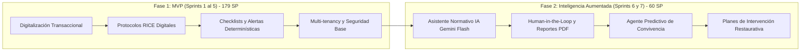

# REGISTRO HISTÓRICO CONSOLIDADO DE SPRINTS
## Sistema de Gestión y Acompañamiento Escolar (SIGA Escolar)

**Cliente:** Escuela Coeducacional N° 1 El Salvador, Atacama, Chile  
**Metodología:** Marco Ágil Scrum (Sprints de 1 a 2 semanas)  
**Herramienta de Gestión:** Atlassian Jira (`SE` — SIGA Escolar)  
**Equipo de Desarrollo:**
* **Marcelo Andrés Acevedo Silva:** Product Owner / Líder Técnico / Backend, Base de Datos y Seguridad.
* **Daniel Flores Jaime:** Frontend Lead / Arquitectura UI/UX / Componentes React, Zustand y Tailwind CSS.
* **Claudia Infane Soto:** Documentación Técnica, Diseño Web y QA.

---

## 1. TABLA CONSOLIDADA DE SPRINTS Y VELOCIDAD

### 1.1 Sprints Ejecutados y Certificados (Fase MVP — 100% Cumplido)

| Sprint | Foco Principal | Período de Ejecución | SP Comprometidos | SP Completados | Estado |
| :--- | :--- | :---: | :---: | :---: | :---: |
| **Sprint 1** | Infraestructura base, BD multi-tenant, Auth JWT, RLS y setup frontend | 02 jun – 15 jun 2026 | 34 pts | 34 pts | ✅ Completado |
| **Sprint 2** | Módulos Core: Usuarios, Estudiantes, Cursos, Incidentes y Protocolos RICE | 16 jun – 24 jun 2026 | 42 pts | 42 pts | ✅ Completado |
| **Sprint 3** | Analítica (Recharts), Reportes PDF, Despliegue en Producción y UAT | 25 jun – 01 jul 2026 | 38 pts | 38 pts | ✅ Completado |
| **Sprint 4** | Motor de Reglas RICE, Semáforo de Urgencia y Scoring de Riesgo | 02 jul – 09 jul 2026 | 21 pts | 21 pts | ✅ Completado |
| **Sprint 5** | Checklist RICE estricto, Alertas Escalada, Configuración, PIE y Cursos en Cascada | 08 sep – 09 sep 2026 | 36 pts | 36 pts | ✅ Completado |
| **Inc. UI** | HU 5.6 — Rediseño de Login Screen, Vector de Estudiantes, Favicon y Responsive | 09 sep – 10 sep 2026 | 8 pts | 8 pts | ✅ Completado |
| **SUBTOTAL MVP** | **Alcance Base del Proyecto SIGA Escolar** | **Junio – Septiembre 2026** | **179 pts** | **179 pts** | **100% Certificado** |

### 1.2 Sprints Planificados de Evolución (Fase Post-MVP — Inteligencia Artificial Aplicada)

| Sprint | Foco Principal | Estimación Temporal | SP Estimados | Estado |
| :--- | :--- | :---: | :---: | :---: |
| **Sprint 6** | Asistente de Redacción Normativa con IA (Google Gemini Flash), Modal de Revisión y Reporte Oficial PDF | 7 días corridos | 28 pts | 🟡 En Planificación / Por Iniciar |
| **Sprint 7** | Agente de Inteligencia Predictiva y Soluciones Preventivas de Convivencia (Google Gemini Flash) | 10 días corridos | 32 pts | ⚪ Propuesto y Diseñado |
| **TOTAL SISTEMA**| **Consolidado Global (MVP + Plataforma de Inteligencia Escolar)** | **2026** | **239 pts** | **60 pts en Evolución** |

---

## 2. DETALLE DE EJECUCIÓN POR SPRINT

---

### SPRINT 1 — Infraestructura y Núcleo del Sistema
* **Período:** 02 al 15 de junio 2026 | **Story Points:** 34 pts | **Estado:** 100% Completado
* **Objetivo:** Establecer los cimientos tecnológicos del monorepo, la base de datos relacional multi-tenant con Row Level Security (RLS), la seguridad de acceso (JWT/bcrypt/RBAC) y la bitácora invisible de auditoría.

#### Entregables y Tareas Técnicas:
1. **Base de Datos Multi-tenant (PostgreSQL / Supabase):**
   - Creación del proyecto Supabase y modelado de las 14 tablas principales.
   - Activación de Row Level Security (RLS) en todas las tablas con la función RPC `set_tenant(uuid)`.
   - Extensión `unaccent` y funciones de búsqueda de estudiantes accent-insensitive.
   - Triggers de integridad referencial para protocolos RICE y validación de pertenencia.
2. **Backend Core (Node.js 22 + Express 5):**
   - Configuración de cabeceras de seguridad HTTP con Helmet y CORS estricto.
   - Autenticación JWT con expiración de 8 horas y hash de contraseñas con bcrypt (coste 10).
   - Bloqueo temporal por 15 minutos tras 5 intentos fallidos en tabla `intentos_login`.
   - Middleware de auditoría asíncrono (`auditLogger.js`) para registro inmutable en tabla `auditoria`.
   - Middleware de autorización basada en roles (`requireRole`) para los 5 perfiles escolares.
3. **Frontend Base (React 18 + Vite 5 + Tailwind CSS 3):**
   - Configuración de Zustand para el manejo de estado de sesión (`useAuthStore`).
   - Cliente Axios centralizado con interceptores automáticos de JWT y manejo unificado de errores.
   - Componentes de layout responsive: sidebar, barra superior y enrutador con rutas privadas (`PrivateRoute`, `RoleRoute`).

---

### SPRINT 2 — Lógica de Negocio y Módulos Core
* **Período:** 16 al 24 de junio 2026 | **Story Points:** 42 pts | **Estado:** 100% Completado
* **Objetivo:** Desarrollar los flujos operacionales principales para la gestión de usuarios, estudiantes, cursos, registro de incidentes y tramitación de protocolos RICE.

#### Entregables y Tareas Técnicas:
1. **Gestión de Estudiantes y Cursos:**
   - Ficha integral del estudiante con RUT validado bajo algoritmo chileno Módulo 11.
   - Importador masivo de estudiantes vía archivo CSV con detección de duplicados y reporte de inconsistencias.
   - CRUD de cursos estructurados por nivel y letra con asociación a profesor jefe.
2. **Gestión de Incidentes de Convivencia Escolar:**
   - Formulario de registro de incidentes con categorización por gravedad (Leve, Grave, Gravísimo).
   - Clasificación según los 7 tipos de abordaje normativos (indagación, conflicto, contención, mediación, etc.).
   - Asociación N:M de estudiantes involucrados con identificación explícita de víctima y agresor.
3. **Módulo de Protocolos RICE:**
   - Activación de protocolos RICE directamente asociados al incidente de origen.
   - Máquina de estados de protocolos (`ABIERTO`, `EN_PROCESO`, `DERIVADO`, `RESUELTO`, `CERRADO`).
   - Notificaciones contextuales al equipo directivo ante casos graves.

---

### SPRINT 3 — Analítica, Reportería y Despliegue en Producción
* **Período:** 25 de junio al 01 de julio 2026 | **Story Points:** 38 pts | **Estado:** 100% Completado
* **Objetivo:** Implementar la visualización gráfica de indicadores en tiempo real, exportación documental en PDF con validez institucional, despliegue continuo en la nube y pruebas UAT.

#### Entregables y Tareas Técnicas:
1. **Dashboard Analítico (Recharts):**
   - Gráfico de dona (Donut Chart) con distribución porcentual de abordajes de convivencia.
   - Gráfico de barras de evolución temporal mensual de incidentes.
   - Tarjetas de resumen ejecutivo de casos activos, protocolos en curso y alumnos en seguimiento.
2. **Reportería Documental (PDFKit):**
   - Generación en backend de informes PDF descargables con membrete oficial del colegio.
   - Inclusión de historial cronológico, participantes, medidas adoptadas y firmas de responsabilidad.
3. **Despliegue Continuo (CI/CD) en la Nube:**
   - Frontend desplegado en **Vercel** con CDN global y soporte HTTPS/SSL.
   - Backend desplegado en **Render PaaS** con Node.js 22 y conexión SSL a Supabase.
   - Ejecución de la primera fase de pruebas de aceptación de usuario (UAT) con el cliente.

---

### SPRINT 4 — Motor de Reglas, Semáforo de Urgencia y Scoring de Riesgo
* **Período:** 02 al 09 de julio 2026 | **Story Points:** 21 pts | **Estado:** 100% Completado
* **Objetivo:** Automatizar el control de plazos normativos RICE exigidos por la Superintendencia y proporcionar alertas tempranas de reincidencia mediante scoring algorítmico.

#### Entregables y Tareas Técnicas:
1. **Motor de Reglas RICE y Semáforo de Urgencia:**
   - Algoritmo de cálculo de días hábiles restantes por tipo de protocolo según plazos normativos.
   - Clasificación semafórica visual: Verde (al día / > 5 días), Amarillo (próximo a vencer / $\le$ 5 días) y Rojo (plazo vencido).
   - Widget en Dashboard directivo con listado priorizado de protocolos urgentes.
2. **Scoring de Riesgo Conductual:**
   - Cálculo algorítmico de índice de riesgo por estudiante ponderando cantidad, gravedad y recurrencia temporal.
   - Badges visuales de riesgo (`Bajo`, `Medio`, `Alto`, `Crítico`) en listas y fichas de estudiantes.
   - Sugerencias preventivas automáticas para el equipo psicosocial.

---

### SPRINT 5 — Checklist RICE Estricto, Alertas de Escalada, Configuración y Cascada
* **Período:** 08 al 09 de septiembre 2026 | **Story Points:** 36 pts | **Estado:** 100% Completado
* **Objetivo:** Cumplimiento normativo riguroso con checklists por pasos, banner de alertas de escalada, panel de configuración administrativa de parámetros, soporte PIE y navegación en cascada.

#### Entregables y Tareas Técnicas:
1. **HU 5.1 — Checklist Normativo RICE Estricto (8 SP):**
   - Tabla `protocolo_pasos` en Supabase con pasos secuenciales obligatorios por cada protocolo.
   - Componentes `ChecklistProtocolo.jsx` y `CompletarPasoModal.jsx` con bitácora de evidencias y validación obligatoria.
   - Bloqueo de cierre de protocolo si existen pasos normativos pendientes.
2. **HU 5.2 — Alertas de Escalada y Casos Críticos (6 SP):**
   - Detección automática en backend y frontend de incidentes con gravedad Grave o Gravísima.
   - Componente `AlertaEscaladaBanner.jsx` desplegado en Dashboard y listados con animación de pulso y acceso rápido al caso.
3. **HU 5.3 — Panel de Configuración Administrativa (8 SP):**
   - Tabla `configuracion_sistema` en Supabase para parametrizar plazos RICE y factores de scoring sin tocar código.
   - Vista `ConfiguracionPage.jsx` con edición en vivo, validaciones numéricas y permisos exclusivos de Administrador.
4. **HU 5.4 — Integración del Programa de Integración Escolar (PIE) (8 SP):**
   - Campo booleano `es_pie` y tipo de diagnóstico en ficha de estudiante y migración DDL.
   - Badges de identificación en listados para que el equipo docente adapte protocolos según necesidades especiales.
5. **HU 5.5 — Períodos Académicos y Búsqueda en Cascada (6 SP):**
   - Tabla `periodos_academicos` y columnas `periodo_id` y `letra` en tabla `cursos`.
   - Componente `SelectorEstudianteCascada.jsx`: navegación interactiva guiada (Nivel $\rightarrow$ Letra $\rightarrow$ Alumnos) y modo dual con buscador por RUT.

---

### INCREMENTO UI (SPRINT 5+) — HU 5.6: Rediseño Moderno de Interfaz de Login
* **Período:** 09 al 10 de septiembre 2026 | **Story Points:** 8 pts | **Estado:** 100% Completado
* **Objetivo:** Renovar completamente la experiencia de acceso (UX/UI) basada en la maqueta de diseño institucional `DOCS/ui/login_screen.jpeg`.

#### Entregables y Tareas Técnicas:
1. **Nueva Interfaz `LoginPage.jsx`:**
   - Fondo azul marino (`#071526`) con partículas bokeh animadas mediante keyframes CSS acelerados por GPU (`animate-float-slow`, `animate-float-medium`, `animate-float-fast`, `animate-pulse-glow`).
   - Tarjeta central flotante color menta pastel con inputs cápsula redondeados (`bg-[#11232f]`).
   - Botón interactivo accesible para alternar visibilidad de contraseña (ver/ocultar clave) con feedback auditivo y visual.
   - Modales accesibles de *"Términos y Servicios"* y *"Soporte y Contacto"*, suprimiendo autoregistro no institucional.
2. **Identidad Gráfica y Assets Vectoriales:**
   - Incorporación de la ilustración vectorial oficial de estudiantes (`DOCS/ui/img_students.svg`).
   - Posicionamiento centrado del nuevo logo institucional (`DOCS/ui/siga-escolar-logo.png`) sobre el título "Acceder", con escala y legibilidad optimizadas.
   - Integración del favicon oficial vectorial (`DOCS/ui/favicon.svg`) en `index.html` y precache PWA en `vite.config.js`.
3. **Responsividad Móvil Estricta:**
   - Ocultamiento automático de la ilustración en pantallas pequeñas (`< md`) para un acceso ágil y sin distracciones.
4. **Validación y Pruebas:**
   - 9 de 9 pruebas unitarias aprobadas en `src/__tests__/pages/LoginPage.test.jsx`.
   - Cobertura superior al 97% en declaraciones, 100% en ramas y 96.96% en líneas.

---

### SPRINT 6 — Asistente de Redacción Normativa con IA y Emisión Oficial PDF
* **Período Estimado:** 7 días corridos | **Story Points Estimados:** 28 pts | **Estado:** 🟡 En Planificación / Por Iniciar
* **Objetivo:** Reducir la sobrecarga administrativa del equipo de convivencia mediante un asistente basado en **Google Gemini Flash** que genere propuestas estructuradas de informes de incidentes en formato JSON (contexto, hechos objetivos, medidas adoptadas, acuerdos y seguimiento), permitiendo su revisión modular en un modal interactivo en React (*Human-in-the-Loop*) y su posterior emisión oficial en PDF institucional con sellos de tiempo y bloques de firma.

#### Tecnologías Involucradas:
* **Backend:** `@google/genai` (Google Gemini 2.0/1.5 Flash), Node.js 22, Express 5, `pdfkit` (motor vectorial de documentos), Zod (validación de schemas JSON estructurados).
* **Frontend:** React 18, Tailwind CSS 3, Zustand (gestión de estado de reportes), Lucide Icons.
* **Base de Datos:** PostgreSQL 15 en Supabase (tabla `reportes_incidentes`, RLS por tenant, índices relacionales).

#### Desglose de Historias de Usuario:
1. **HU 6.1 — Generación Asistida de Borrador de Informe con Sanitización DLP (10 SP):**
   * *Descripción:* Como encargado de convivencia o inspector, quiero solicitar la generación de un borrador preliminar de reporte de incidente con apoyo de IA para reducir de 20 minutos a menos de 3 minutos el tiempo de redacción de actas escolares.
   * *Tareas Técnicas:*
     - Instalación y configuración desacoplada de `@google/genai` con fallback y rate limiting.
     - Pipeline de sanitización DLP (`reporteSanitizer.js`): anonimización de RUTs, nombres y datos de contacto de estudiantes antes del despacho a la API externa.
     - Definición de Prompt Normativo con *System Instructions* alineadas a la Circular N° 482 (tono objetivo, tercera persona, sin adjetivos peyorativos o revictimizantes).
     - Endpoint `POST /api/v1/incidentes/:id/borrador-reporte` con validación Zod y respuesta JSON estructurada en 5 secciones.
   * *Criterios de Aceptación:*
     - La respuesta de Gemini Flash tarda < 3.5 s en P95.
     - Cero datos sensibles de menores (PII) son expuestos a la API externa.
     - La estructura devuelta contiene obligatoriamente: Contexto, Hechos, Medidas, Acuerdos y Seguimiento.
2. **HU 6.2 — Modal de Revisión Modular y Human-in-the-Loop en Frontend (10 SP):**
   * *Descripción:* Como profesional de convivencia o directivo, quiero revisar y editar de forma independiente cada bloque del borrador generado en `IncidenteDetallePage` para garantizar que el criterio pedagógico humano prevalezca antes de oficializar cualquier documento.
   * *Tareas Técnicas:*
     - Componente modal interactivo `ModalRevisionReporteIA.jsx` con acordeones o tabs por sección.
     - Botón "Regenerar propuesta" con confirmación para evitar pérdidas accidentales de cambios manuales.
     - Botón "Guardar Borrador" (`PATCH /api/v1/incidentes/:id/reporte`) para persistir trabajo en curso sin oficializar.
     - Botón "Aprobar y Oficializar" reservado exclusivamente para roles de jefatura (`Administrador`, `Equipo de Formación`).
   * *Criterios de Aceptación:*
     - El usuario puede editar libremente cualquier párrafo sugerido por la IA.
     - Se mantiene indicador visual de si el texto es sugerencia IA o fue modificado por el profesional.
     - Se bloquea la oficialización si alguna sección obligatoria queda vacía.
3. **HU 6.3 — Generación y Descarga de Reporte Oficial en PDF con Membrete y Firmas (8 SP):**
   * *Descripción:* Como directivo o apoderado, quiero descargar e imprimir el reporte oficial aprobado en un formato PDF formal con membrete del colegio y campos de firma para archivar la evidencia ante fiscalizaciones de la Superintendencia.
   * *Tareas Técnicas:*
     - Extensión de `pdfService.js` en backend con la función `generarReporteOficialPDF(incidente, reporteAprobado)`.
     - Inclusión de encabezado institucional (*Escuela Coeducacional N° 1 El Salvador*), folio único, fecha de aprobación y glosa de verificación de integridad.
     - Bloque inferior de firmas de conformidad física para Coordinador/a de Convivencia y Director/a.
     - Endpoint seguro `GET /api/v1/incidentes/:id/reporte/pdf` con stream de descarga directa.
   * *Criterios de Aceptación:*
     - El PDF solo puede descargarse si el reporte se encuentra en estado `Aprobado`.
     - El diseño se ajusta estrictamente al formato corporativo tamaño A4 en escala tipográfica legible.

---

### SPRINT 7 — Agente de Inteligencia Predictiva y Soluciones Preventivas de Convivencia
* **Período Estimado:** 10 días corridos | **Story Points Estimados:** 32 pts | **Estado:** ⚪ Propuesto y Diseñado (Post-MVP)
* **Objetivo:** Transformar el modelo de convivencia escolar desde una gestión reactiva hacia un **enfoque proactivo, predictivo y restaurativo**. Implementar un agente inteligente basado en **Google Gemini Flash** que combine analítica de series temporales de la base de datos relacional con razonamiento cualitativo para identificar patrones emergentes de conflicto, pronosticar riesgos de escalada y formular automáticamente planes de intervención formativos personalizados para la Dupla Psicosocial y los Profesores Jefes.

#### Tecnologías Involucradas:
* **Backend:** `@google/genai` (Google Gemini Flash con System Instructions psicosociales), PostgreSQL 15 (vistas materializadas, funciones de agregación temporal y scoring multivariante), Node.js 22, Express 5.
* **Frontend:** React 18, Recharts (mapa de calor de conflicto por curso/horario, curvas de tendencia predictiva), Tailwind CSS 3.
* **Inteligencia Artificial y Ética:** Explicabilidad de decisiones (XAI - Explainable AI), políticas de Criterio No Punitivo, protocolos de confidencialidad estricta para salud mental y convivencia.

#### Desglose de Historias de Usuario:
1. **HU 7.1 — Motor de Diagnóstico Predictivo y Correlación Multivariable (12 SP):**
   * *Descripción:* Como directivo o coordinador de convivencia, quiero consultar un análisis predictivo de patrones de conflicto que correlacione cursos, horarios, antecedentes de mediación y recurrencia temporal para anticipar situaciones de riesgo antes de que escalen a violencia grave.
   * *Tareas Técnicas:*
     - Función SQL en Supabase `obtener_matriz_conductual_estudiante(estudiante_id, ventana_dias)` para consolidar tipos de falta, intervalos entre eventos y gravedad.
     - Correlación algorítmica con factores de inclusión escolar (condición PIE) y tipos de abordaje previos (contención vs mediación).
     - Síntesis analítica con Google Gemini Flash estructurada en: Probabilidad de reincidencia, Factores detonantes identificados y Nivel de vulnerabilidad.
     - Endpoint analítico `GET /api/v1/analitica/prediccion/estudiante/:id`.
   * *Criterios de Aceptación:*
     - La inferencia no genera juicios subjetivos ni etiquetado peyorativo de estudiantes.
     - Toda predicción explicita los factores objetivos y fechas de los antecedentes que la sustentan (XAI).
2. **HU 7.2 — Generador Inteligente de Planes de Acción Preventivos y Restaurativos (12 SP):**
   * *Descripción:* Como miembro de la Dupla Psicosocial (Trabajador/a Social o Psicólogo/a), quiero que el agente de IA proponga estrategias formativas y acuerdos restaurativos concretos adaptados a la realidad del estudiante para intervenir a tiempo con las familias y docentes.
   * *Tareas Técnicas:*
     - Generación mediante Gemini Flash de planes de intervención estructurados:
       a) Acciones sugeridas para el Profesor Jefe en aula (adecuaciones metodológicas, manejo conductual).
       b) Estrategias de mediación restaurativa con pares y familias.
       c) Recomendación de derivación oportuna a redes de apoyo externas (CESFAM, COSAM, Habilidades para la Vida).
     - Componente frontend `PlanAccionPreventivoCard.jsx` en ficha del estudiante con opciones para adoptar, personalizar o descartar cada medida sugerida.
     - Persistencia de planes adoptados en tabla `planes_intervencion_preventiva`.
   * *Criterios de Aceptación:*
     - Prohibición estricta de sugerir sanciones punitivas o expulsiones en el *system prompt*.
     - Las recomendaciones distinguen adecuadamente a estudiantes del Programa de Integración Escolar (PIE) para respetar sus adecuaciones curriculares.
3. **HU 7.3 — Dashboard de Monitoreo Preventivo y Evaluación de Efectividad (8 SP):**
   * *Descripción:* Como directivo escolar, quiero visualizar en un panel centralizado la efectividad de las medidas preventivas implementadas para certificar si las intervenciones tempranas disminuyen efectivamente los incidentes graves en el tiempo.
   * *Tareas Técnicas:*
     - Vista interactiva `DashboardPreventivoPage.jsx` con Recharts.
     - Indicador de "Tasa de Mitigación": porcentaje de estudiantes con plan activo que no registraron reincidencia en 60 días.
     - Mapa de calor de vulnerabilidad por curso y jornada para focalizar talleres preventivos grupales.
   * *Criterios de Aceptación:*
     - Métricas en tiempo real actualizadas dinámicamente según el cierre de protocolos y planes.
     - Acceso restringido exclusivamente a roles `Administrador`, `Directivo` y `Equipo de Formación`.

---

## 3. IMPACTO EN EL PROYECTO DE TÍTULO: DE MVP A PLATAFORMA DE INTELIGENCIA EDUCATIVA

La incorporación de los Sprints 6 y 7 marca el punto de inflexión donde **SIGA Escolar deja de ser un Producto Mínimo Viable (MVP)** y se consolida como una **Plataforma Integral de Convivencia e Inteligencia Escolar de Grado Enterprise**:

1. **Aporte Académico y Tecnológico (INACAP / PMBOK / IEEE 830):**
   * El MVP demostró la viabilidad técnica y operativa de sustituir el papel por una arquitectura multi-tenant moderna en la Escuela El Salvador.
   * La fase evolutiva incorpora **Inteligencia Artificial Aplicada de última generación (Google Gemini Flash)** para resolver el doble desafío crítico de la educación pública chilena: la asfixia administrativa docente y la necesidad de anticipación temprana a la violencia escolar.
2. **Costo Cero y Escalabilidad Sostenible:**
   * El aprovechamiento de las cuotas de desarrollo de Google AI Studio garantiza que el establecimiento acceda a capacidades avanzadas de IA sin incurrir en costos recurrentes de licenciamiento.
3. **Privacidad y Ética Garantizada por Diseño:**
   * Cumplimiento irrestricto de la Ley N° 19.628 y Circular N° 482 mediante pipelines de sanitización DLP y principio de no discriminación algorítmica.

---

## 4. CERTIFICACIÓN GLOBAL DE CALIDAD Y PRUEBAS

* **Frontend:** 115 pruebas unitarias y de integración aprobadas en 23 suites de prueba (Vitest + React Testing Library).
* **Backend:** Pruebas de integración aprobadas en Jest para servicios, autenticación y consultas en cascada.
* **Compilación y Build:** `npm run build` en Vite genera bundles minificados y Service Worker PWA con 0 advertencias críticas.
* **Análisis Estático:** Cero errores de ESLint en componentes principales y suites de pruebas.

---

*Documento consolidado en `DOCS/sprints/SPRINTS_CONSOLIDADOS.md`. Los reportes históricos parciales se conservan en `DOCS/sprints/historico/`.*
