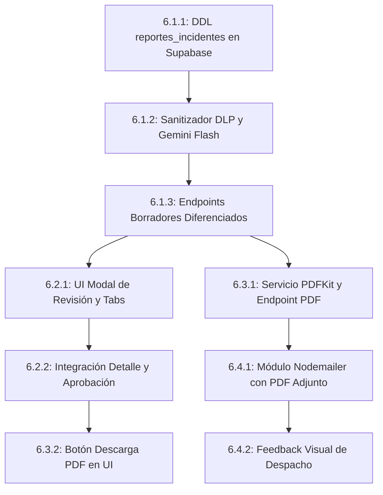

# SIGA Escolar — Guía Completa: Crear Sprint 6 Manualmente en Jira
## Asistente de Redacción Normativa de Informes con IA (Google Gemini Flash) y Emisión Oficial PDF

> **Capacidad comprometida:** 28 puntos (Marcelo Acevedo 17 pts + Daniel Flores 11 pts)  
> **Duración estimada:** 7 a 10 días corridos  
> **Épica Asociada:** `Inteligencia Artificial y Reportería Normativa Escolar` (o clave Jira `SE-65`)  
> **Objetivo:** Implementar el asistente inteligente de redacción de informes y actas oficiales de incidentes escolares asistido por **Google Gemini Flash** (costo cero en Google AI Studio), con sanitización estricta de datos personales de menores (DLP), generación de informes diferenciados e individualizados por estudiante involucrado, modal interactivo de revisión modular en React (*Human-in-the-Loop*), persistencia con control de versiones en Supabase, emisión de documentos oficiales en PDF con membrete y firmas mediante PDFKit, y despacho automático de copia formal al correo del apoderado titular.

---

## 💡 Fundamentos y Decisiones Validadas con el Cliente (Don Roberto Miranda)

A partir de la consulta formal de definición operativa respondida por la coordinación de convivencia escolar (`DOCS/requerimientos/fuentes_originales/Consulta de Definición Operativa.docx`), el Sprint 6 se rige bajo los siguientes principios mandatorios:

1. **Historial Completo de Versiones y Auditoría (Opción A):**
   * El sistema no sobreescribe borradores. Se crea una tabla dedicada `reportes_incidentes` que almacena el borrador original generado por la IA, las ediciones intermedias realizadas por el profesional, el texto definitivo aprobado, los usuarios responsables y las marcas temporales para responder a eventuales fiscalizaciones de la Superintendencia de Educación.
2. **Matriz de Permisos Diferenciada (Generación vs Aprobación):**
   * **Generación y Edición del Borrador:** Habilitado para inspectores, dupla psicosocial, equipo de convivencia y directivos (`Inspector`, `Equipo de Formación`, `Directivo`, `Administrador`).
   * **Aprobación Formal y Emisión Oficial:** Restringido por normativa institucional al Director/a, Inspector/a General y Coordinador/a de Convivencia (`Directivo`, `Administrador`, `Equipo de Formación` e `Inspector`).
3. **Requisito Crítico: Informes Diferenciados por Estudiante:**
   * *"En caso si el informe aborda a más de dos personas, se deben crear informes diferenciados"*.
   * En cumplimiento de la **Ley N° 19.628** de Protección de la Vida Privada y la **Circular N° 482**, ningún apoderado puede recibir un documento que individualice o exponga datos sensibles de las otras partes involucradas. Si un incidente tiene 3 involucrados, el sistema genera 3 propuestas de informe independientes y contextualizadas a cada pupilo.
4. **Doble Vía de Emisión:**
   * **Descarga e impresión física:** PDF formal en tamaño A4 con membrete institucional y líneas para firmas manuales de puño y letra.
   * **Despacho digital:** Envío automático por correo electrónico con copia adjunta al apoderado titular registrado en el sistema.

---

## PASO 0 — Crear el Sprint 6 en Jira

1. Ir a la vista **Backlog** del proyecto SIGA-escolar en Jira.
2. Hacer clic en **Crear sprint**.
3. Completar los campos con los siguientes datos:

| Campo | Valor |
|-------|-------|
| **Nombre del sprint** | Sprint 6 |
| **Fecha de inicio** | _(Día hábil siguiente al cierre del Sprint 5)_ |
| **Fecha de finalización** | _(+7 a 10 días corridos)_ |
| **Objetivo del sprint** | Entregar el asistente de redacción de informes con IA (Google Gemini Flash), sanitización DLP, reportes diferenciados por estudiante, modal de revisión modular Human-in-the-Loop, generación server-side de PDF formal con firmas y notificación por correo al apoderado. |

---

## PASO 1 — Épica Asociada

| Campo | Valor |
|-------|-------|
| **Tipo** | Epic |
| **Clave / Nombre** | `Inteligencia Artificial y Reportería Normativa Escolar` |
| **Descripción** | Implementar la primera capa de inteligencia artificial aplicada en SIGA Escolar mediante Google Gemini Flash, orientada a reducir la asfixia administrativa del equipo de convivencia y directivos al momento de formalizar actas y reportes oficiales de incidentes conforme a la Circular 482 de la Superintendencia de Educación. |
| **Prioridad** | Alta |
| **Etiquetas** | `backend`, `frontend`, `ia`, `gemini`, `pdf`, `dlp`, `reportes`, `convivencia` |

---

## PASO 2 — Historias de Usuario del Sprint 6

---

### HISTORIA 1: HU 6.1 – Generación Asistida de Borradores de Informes con Gemini Flash y Sanitización DLP

| Campo | Valor |
|-------|-------|
| **Tipo** | Historia |
| **Resumen** | HU 6.1 – Generación Asistida de Borradores con Gemini Flash y Sanitización DLP |
| **Épica** | Inteligencia Artificial y Reportería Normativa Escolar |
| **Descripción** | **Como** funcionario de convivencia, inspector o directivo, **quiero** generar automáticamente un borrador estructurado de reporte de incidente con asistencia de IA **para** reducir de 20 minutos a menos de 3 minutos la confección de actas, garantizando un relato objetivo, pedagógico y sin juicios subjetivos conforme a la Circular N° 482. |
| **Criterios de Aceptación** | 1. Integración con Google Gemini Flash (`@google/genai`) utilizando cuota gratuita de Google AI Studio.<br>2. Pipeline DLP de sanitización previa: se eliminan RUTs, direcciones y teléfonos, y se tokenizan nombres antes de enviar datos al LLM.<br>3. Generación en formato JSON estructurado con 5 secciones obligatorias: Contexto, Hechos Objetivos, Medidas Adoptadas, Acuerdos y Plan de Seguimiento.<br>4. Si el incidente involucra a más de un estudiante, el sistema genera automáticamente borradores diferenciados por cada alumno.<br>5. Persistencia con versionado en la nueva tabla `reportes_incidentes`. |
| **Asignado a** | Marcelo Acevedo |
| **Prioridad** | Alta |
| **Etiquetas** | `backend`, `ia`, `gemini`, `dlp`, `seguridad`, `api` |
| **Sprint** | Sprint 6 |
| **Estado inicial** | POR HACER |

---

### HISTORIA 2: HU 6.2 – Modal de Revisión Modular y Control Human-in-the-Loop en Frontend

| Campo | Valor |
|-------|-------|
| **Tipo** | Historia |
| **Resumen** | HU 6.2 – Modal de Revisión Modular y Control Human-in-the-Loop en Frontend |
| **Épica** | Inteligencia Artificial y Reportería Normativa Escolar |
| **Descripción** | **Como** usuario revisor, **quiero** examinar y editar de forma independiente cada sección del borrador generado por la IA en `IncidenteDetallePage` **para** garantizar que prevalezca el criterio profesional humano y ajustar los detalles pedagógicos antes de oficializar el documento. |
| **Criterios de Aceptación** | 1. Modal interactivo `ModalRevisionReporteIA.jsx` accesible desde `IncidenteDetallePage.jsx` mediante botón "Generar Informe con IA".<br>2. Pestañas (Tabs) independientes para alternar entre informes de distintos estudiantes si el incidente involucra a más de uno.<br>3. Edición modular de cada sección mediante inputs/textareas independientes.<br>4. Botón "Regenerar Propuesta" con diálogo de confirmación.<br>5. Botón "Guardar Borrador" para persistir el trabajo en curso sin oficializarlo.<br>6. Botón "Aprobar y Oficializar" habilitado exclusivamente para roles autorizados (Directivo, Inspector, Equipo de Formación). |
| **Asignado a** | Daniel Flores |
| **Prioridad** | Alta |
| **Etiquetas** | `frontend`, `ui`, `modal`, `human-in-the-loop`, `react` |
| **Sprint** | Sprint 6 |
| **Estado inicial** | POR HACER |

---

### HISTORIA 3: HU 6.3 – Generación y Descarga de Informe Oficial en PDF con Membrete y Firmas

| Campo | Valor |
|-------|-------|
| **Tipo** | Historia |
| **Resumen** | HU 6.3 – Generación y Descarga de Informe Oficial en PDF con Membrete y Firmas |
| **Épica** | Inteligencia Artificial y Reportería Normativa Escolar |
| **Descripción** | **Como** directivo o coordinador de convivencia, **quiero** descargar e imprimir el informe oficial en formato PDF formal con membrete del establecimiento y campos de firma física **para** archivar el respaldo legal de la intervención en inspectoría y presentar ante fiscalizaciones de la Superintendencia. |
| **Criterios de Aceptación** | 1. Generación server-side mediante `pdfkit` en tamaño A4 con diseño institucional (Escuela Coeducacional N° 1 El Salvador).<br>2. Inclusión de folio único correlativo, fecha de emisión, fecha de aprobación y glosa de autenticidad.<br>3. El PDF solo se puede generar si el reporte se encuentra en estado `Aprobado`.<br>4. Bloque inferior de firmas para Coordinador/a de Convivencia y Director/a / Inspector/a General.<br>5. Descarga ágil mediante endpoint seguro `GET /api/v1/incidentes/:id/reportes/:reporteId/pdf`. |
| **Asignado a** | Marcelo Acevedo |
| **Prioridad** | Alta |
| **Etiquetas** | `backend`, `pdf`, `pdfkit`, `descarga`, `auditoria` |
| **Sprint** | Sprint 6 |
| **Estado inicial** | POR HACER |

---

### HISTORIA 4: HU 6.4 – Notificación y Envío Automático de Copia en PDF al Apoderado Titular

| Campo | Valor |
|-------|-------|
| **Tipo** | Historia |
| **Resumen** | HU 6.4 – Notificación y Envío Automático de Copia en PDF al Apoderado Titular |
| **Épica** | Inteligencia Artificial y Reportería Normativa Escolar |
| **Descripción** | **Como** apoderado titular, **quiero** recibir en mi correo electrónico una copia formal del informe de convivencia correspondiente a mi pupilo una vez aprobado por la dirección **para** estar informado fidedignamente de los acuerdos y medidas formativas acordadas por el colegio. |
| **Criterios de Aceptación** | 1. Envío automático por correo electrónico mediante `nodemailer` al aprobar el informe oficial.<br>2. El correo incluye plantilla HTML formal con saludo, resumen no estigmatizante y el PDF oficial adjunto.<br>3. En caso de incidentes con múltiples involucrados, el apoderado recibe únicamente el informe diferenciado de su propio pupilo.<br>4. Registro de auditoría del despacho en bitácora (`auditoria`).<br>5. Si el apoderado no tiene email registrado, el sistema alerta visualmente para entrega física en inspectoría. |
| **Asignado a** | Marcelo Acevedo |
| **Prioridad** | Media |
| **Etiquetas** | `backend`, `email`, `nodemailer`, `apoderados`, `notificaciones` |
| **Sprint** | Sprint 6 |
| **Estado inicial** | POR HACER |

---

## PASO 3 — Desglose de Tareas Técnicas Detalladas

---

### Tareas de HU 6.1 (Generación Asistida con Gemini Flash y DLP)

---

#### TAREA 6.1.1 — Modelo DDL `reportes_incidentes` con RLS y Control de Versiones en Supabase

| Campo | Valor |
|-------|-------|
| **Tipo** | Tarea |
| **Resumen** | 6.1.1 Modelo DDL `reportes_incidentes` con RLS y versionado |
| **Historia padre** | HU 6.1 – Generación Asistida de Borradores con Gemini Flash y Sanitización DLP |
| **Asignado a** | Marcelo Acevedo |
| **Story Points** | 3 |
| **Prioridad** | Alta |
| **Etiquetas** | `backend`, `bd`, `supabase`, `ddl`, `rls` |
| **Sprint** | Sprint 6 |
| **Descripción** | Crear la tabla de base de datos en Supabase para soportar la persistencia de los reportes generados con IA, permitiendo versionado y trazabilidad.<br><br>**Subtareas:**<br>1. Ejecutar DDL en Supabase para la tabla `reportes_incidentes`:<br>```sql
CREATE TABLE IF NOT EXISTS reportes_incidentes (
  id UUID PRIMARY KEY DEFAULT uuid_generate_v4(),
  tenant_id UUID NOT NULL REFERENCES tenants(id) ON DELETE CASCADE,
  incidente_id UUID NOT NULL REFERENCES incidentes(id) ON DELETE CASCADE,
  estudiante_id UUID NOT NULL REFERENCES estudiantes(id) ON DELETE CASCADE,
  version INT NOT NULL DEFAULT 1,
  estado VARCHAR(20) NOT NULL DEFAULT 'Borrador' CHECK (estado IN ('Borrador', 'Aprobado')),
  contenido_borrador JSONB NOT NULL,
  contenido_editado JSONB,
  contenido_aprobado JSONB,
  creado_por UUID NOT NULL REFERENCES usuarios(id),
  aprobado_por UUID REFERENCES usuarios(id),
  fecha_aprobacion TIMESTAMP WITH TIME ZONE,
  email_apoderado_enviado BOOLEAN NOT NULL DEFAULT FALSE,
  fecha_envio_email TIMESTAMP WITH TIME ZONE,
  created_at TIMESTAMP WITH TIME ZONE DEFAULT NOW(),
  updated_at TIMESTAMP WITH TIME ZONE DEFAULT NOW()
);
```<br>2. Habilitar Row Level Security (RLS) en `reportes_incidentes` y crear políticas restrictivas por `tenant_id`.<br>3. Crear índices relacionales en `(tenant_id, incidente_id)` y `(estudiante_id)`. |
| **Criterios de Aceptación** | - Tabla creada con RLS verificado.<br>- Soporta inserción de JSONB estructurado.<br>- Aislamiento estricto multi-tenant comprobado. |

---

#### TAREA 6.1.2 — Pipeline de Sanitización DLP y Servicio Gemini Flash (`@google/genai`)

| Campo | Valor |
|-------|-------|
| **Tipo** | Tarea |
| **Resumen** | 6.1.2 Pipeline de sanitización DLP y cliente Google Gemini Flash |
| **Historia padre** | HU 6.1 – Generación Asistida de Borradores con Gemini Flash y Sanitización DLP |
| **Asignado a** | Marcelo Acevedo |
| **Story Points** | 4 |
| **Prioridad** | Alta |
| **Etiquetas** | `backend`, `ia`, `dlp`, `gemini`, `seguridad` |
| **Sprint** | Sprint 6 |
| **Descripción** | Implementar el servicio de inteligencia artificial y el filtro de protección de datos personales de menores.<br><br>**Subtareas:**<br>1. Instalar `@google/genai` en `siga-backend` y configurar `GEMINI_API_KEY` en `.env`.<br>2. Crear módulo `src/services/dlpSanitizer.js`: función `sanitizarContextoIncidente(incidente, estudianteObjetivo)` que remueve RUTs, direcciones y teléfonos, y enmascara nombres por identificadores neutros (`[Estudiante Foco - 8° Básico]`, `[Involucrado 2 - 8° Básico]`).<br>3. Diseñar `systemInstructions` para Gemini Flash: fijar rol de especialista en convivencia escolar chilena, tono formal, objetivo, en tercera persona, sin calificativos peyorativos ni culpabilizaciones prematuras.<br>4. Configurar respuesta forzada en **JSON estructurado** con Zod schema: `contexto`, `hechos_objetivos`, `medidas_adoptadas`, `acuerdos_compromisos`, `plan_seguimiento`.<br>5. Implementar desanonimizador local para reinyectar los nombres reales de los alumnos en el JSON antes de enviarlo al cliente. |
| **Criterios de Aceptación** | - Cero RUTs o direcciones reales son enviados a Google AI Studio.<br>- La respuesta del modelo llega parseada como objeto JSON válido.<br>- Tiempo de inferencia inferior a 3.5 segundos. |

---

#### TAREA 6.1.3 — Endpoints de Generación y Persistencia de Informes Diferenciados

| Campo | Valor |
|-------|-------|
| **Tipo** | Tarea |
| **Resumen** | 6.1.3 API para generar borradores diferenciados y consultar reportes |
| **Historia padre** | HU 6.1 – Generación Asistida de Borradores con Gemini Flash y Sanitización DLP |
| **Asignado a** | Marcelo Acevedo |
| **Story Points** | 3 |
| **Prioridad** | Alta |
| **Etiquetas** | `backend`, `api`, `controlador`, `reportes` |
| **Sprint** | Sprint 6 |
| **Descripción** | Construir las rutas REST en Express para gestionar el ciclo de vida del reporte.<br><br>**Subtareas:**<br>1. Endpoint `POST /api/v1/incidentes/:id/borrador-reporte`: habilitado para `Administrador`, `Directivo`, `Equipo de Formación` e `Inspector`. Si el incidente tiene $N$ estudiantes, itera y genera $N$ borradores diferenciados en la tabla `reportes_incidentes`.<br>2. Endpoint `GET /api/v1/incidentes/:id/reportes`: retorna todos los reportes asociados al incidente (con datos del estudiante y autor).<br>3. Endpoint `PATCH /api/v1/incidentes/:id/reportes/:reporteId`: permite actualizar `contenido_editado` sin cambiar el estado a `Aprobado`.<br>4. Registrar en bitácora `auditoria` cada solicitud de generación por IA. |
| **Criterios de Aceptación** | - Incidente con 2 alumnos genera 2 registros diferenciados vinculados a cada estudiante.<br>- Incidente de otro tenant retorna 404.<br>- Usuario Docente recibe 403 Forbidden. |

---

### Tareas de HU 6.2 (Modal de Revisión Human-in-the-Loop en Frontend)

---

#### TAREA 6.2.1 — Componente `ModalRevisionReporteIA.jsx` con Edición por Secciones y Tabs

| Campo | Valor |
|-------|-------|
| **Tipo** | Tarea |
| **Resumen** | 6.2.1 UI Modal de revisión modular con pestañas por estudiante |
| **Historia padre** | HU 6.2 – Modal de Revisión Modular y Control Human-in-the-Loop en Frontend |
| **Asignado a** | Daniel Flores |
| **Story Points** | 4 |
| **Prioridad** | Alta |
| **Etiquetas** | `frontend`, `ui`, `modal`, `componentes`, `tabs` |
| **Sprint** | Sprint 6 |
| **Descripción** | Diseñar y construir el modal de edición asistida en React.<br><br>**Subtareas:**<br>1. Crear servicio frontend en `src/services/reportesService.js` (`generarBorradorReporte`, `getReportesIncidente`, `guardarBorradorReporte`, `aprobarReporte`).<br>2. Crear componente `ModalRevisionReporteIA.jsx` con ancho amplio (`max-w-4xl`) y diseño accesible.<br>3. Selector de Pestañas (Tabs) superior: si hay más de un estudiante, renderizar botones con el nombre de cada alumno para editar sus respectivos informes diferenciados.<br>4. Desglose en 5 bloques editables con textarea y contador de caracteres: Contexto, Hechos, Medidas, Acuerdos y Seguimiento.<br>5. Badges informativos: indicador visual de *"Propuesta generada por IA"* y *"Editado manualmente"*. |
| **Criterios de Aceptación** | - Renderizado fluido en escritorio y tabletas.<br>- Alternar entre pestañas preserva las ediciones locales sin borrarlas.<br>- Textareas con auto-expansión vertical para facilitar la lectura. |

---

#### TAREA 6.2.2 — Lógica de Guardado de Borradores y Control de Aprobación RBAC

| Campo | Valor |
|-------|-------|
| **Tipo** | Tarea |
| **Resumen** | 6.2.2 Integración en `IncidenteDetallePage` y acciones de aprobación |
| **Historia padre** | HU 6.2 – Modal de Revisión Modular y Control Human-in-the-Loop en Frontend |
| **Asignado a** | Daniel Flores |
| **Story Points** | 3 |
| **Prioridad** | Alta |
| **Etiquetas** | `frontend`, `integracion`, `rbac`, `incidentes` |
| **Sprint** | Sprint 6 |
| **Descripción** | Vincular el modal al flujo de visualización de incidentes y aplicar restricciones de rol.<br><br>**Subtareas:**<br>1. En `IncidenteDetallePage.jsx`: agregar botón principal *"Generar / Ver Informe Oficial con IA"* con ícono de destello (*sparkles*) de Lucide.<br>2. Estado de carga con spinner y mensaje explicativo: *"Google Gemini Flash está redactando la propuesta objetiva..."*.<br>3. Botón *"Guardar Borrador"*: realiza PATCH silencioso con feedback mediante toast.<br>4. Botón *"Aprobar y Oficializar"*: solicita confirmación modal de advertencia (*"Al aprobar el informe, adquirirá validez oficial e iniciará la emisión de PDF"*). Deshabilitado si el usuario no tiene rol directivo o de coordinación.<br>5. Actualización reactiva del estado del incidente en la vista general. |
| **Criterios de Aceptación** | - Botón visible solo para roles autorizados.<br>- Inspector o dupla pueden guardar borrador, pero el botón de aprobación requiere confirmación de jefatura.<br>- Toast de notificación tras cada guardado exitoso. |

---

### Tareas de HU 6.3 (Generación y Descarga de PDF Oficial)

---

#### TAREA 6.3.1 — Servicio de Renderizado PDFKit y Endpoint de Descarga Oficial

| Campo | Valor |
|-------|-------|
| **Tipo** | Tarea |
| **Resumen** | 6.3.1 Servicio PDFKit con membrete oficial y endpoint stream |
| **Historia padre** | HU 6.3 – Generación y Descarga de Informe Oficial en PDF con Membrete y Firmas |
| **Asignado a** | Marcelo Acevedo |
| **Story Points** | 4 |
| **Prioridad** | Alta |
| **Etiquetas** | `backend`, `pdf`, `pdfkit`, `descarga` |
| **Sprint** | Sprint 6 |
| **Descripción** | Diseñar el documento formal de salida conforme a los estándares de la Escuela El Salvador.<br><br>**Subtareas:**<br>1. En `pdfService.js`: implementar `generarInformeOficialIncidentePDF(reporte, incidente, estudiante, tenant)`.<br>2. Encabezado institucional con membrete oficial azul corporativo, logo, RUT del establecimiento y folio único (`INF-2026-XXXX`).<br>3. Ficha superior del estudiante foco (Nombre, RUT, Curso, Fecha de nacimiento, Condición PIE, Apoderado titular).<br>4. Secciones delineadas con tipografía formal Helvetica: Contexto, Hechos objetivos, Medidas adoptadas, Compromisos y Seguimiento.<br>5. Pie de página con código de verificación, fecha/hora exacta de aprobación y líneas para firma física del Coordinador de Convivencia y Director/a.<br>6. Endpoint `GET /api/v1/incidentes/:id/reportes/:reporteId/pdf`: valida estado `Aprobado` y retorna `Buffer` con cabeceras `Content-Type: application/pdf` y `Content-Disposition: inline`. |
| **Criterios de Aceptación** | - Si el reporte está en estado `Borrador`, la descarga es rechazada con HTTP 400 (*"Debe aprobar el reporte antes de emitir el PDF oficial"*).<br>- Documento A4 perfectamente paginado y visualmente impecable.<br>- Descarga se ejecuta en menos de 1 segundo. |

---

#### TAREA 6.3.2 — Botón y Visor de Descarga de PDF en Frontend

| Campo | Valor |
|-------|-------|
| **Tipo** | Tarea |
| **Resumen** | 6.3.2 Botón de descarga y previsualización de PDF en Detalle |
| **Historia padre** | HU 6.3 – Generación y Descarga de Informe Oficial en PDF con Membrete y Firmas |
| **Asignado a** | Daniel Flores |
| **Story Points** | 2 |
| **Prioridad** | Alta |
| **Etiquetas** | `frontend`, `pdf`, `ui`, `descarga` |
| **Sprint** | Sprint 6 |
| **Descripción** | Facilitar la descarga e impresión directa del documento aprobado.<br><br>**Subtareas:**<br>1. En `IncidenteDetallePage.jsx` y dentro de `ModalRevisionReporteIA.jsx`: mostrar botón destacado *"Descargar PDF Oficial"* cuando el reporte esté en estado `Aprobado`.<br>2. Descarga automática mediante Blob y apertura opcional en nueva pestaña del navegador.<br>3. Badge de estado verde con check: *"Informe Oficial Aprobado por [Nombre] el [Fecha]"*. |
| **Criterios de Aceptación** | - Clic en el botón gatilla la descarga con nombre `Informe_Incidente_[ID]_[Apellido].pdf`.<br>- Manejo correcto de errores con toast si la descarga falla. |

---

### Tareas de HU 6.4 (Envío Automático por Correo al Apoderado)

---

#### TAREA 6.4.1 — Integración Nodemailer y Despacho Automatizado con PDF Adjunto

| Campo | Valor |
|-------|-------|
| **Tipo** | Tarea |
| **Resumen** | 6.4.1 Módulo Nodemailer para notificación con PDF adjunto al apoderado |
| **Historia padre** | HU 6.4 – Notificación y Envío Automático de Copia en PDF al Apoderado Titular |
| **Asignado a** | Marcelo Acevedo |
| **Story Points** | 3 |
| **Prioridad** | Media |
| **Etiquetas** | `backend`, `email`, `nodemailer`, `automatizacion` |
| **Sprint** | Sprint 6 |
| **Descripción** | Implementar la notificación formal al apoderado titular tras la oficialización del caso.<br><br>**Subtareas:**<br>1. Crear plantilla de correo `src/templates/emails/informe-oficial-apoderado.html` con membrete escolar y redacción empática e institucional.<br>2. En `reportesService.js`: al procesar `aprobarReporte()`, consultar datos del apoderado titular en la tabla `apoderados`.<br>3. Si el apoderado tiene email registrado: generar el buffer del PDF e invocar `emailService.enviarCorreoConAdjunto()` adjuntando el documento.<br>4. Actualizar en `reportes_incidentes`: `email_apoderado_enviado = true` y `fecha_envio_email = NOW()`.<br>5. Si no cuenta con email: registrar flag `false` y dejar constancia en auditoría para entrega presencial. |
| **Criterios de Aceptación** | - Apoderado recibe el correo en su bandeja con el PDF formal adjunto.<br>- Cero datos de otros estudiantes son mencionados en el correo.<br>- Fallo de SMTP no revierte la aprobación del reporte en BD (mecanismo no bloqueante). |

---

#### TAREA 6.4.2 — Feedback Visual de Despacho de Correo en Frontend

| Campo | Valor |
|-------|-------|
| **Tipo** | Tarea |
| **Resumen** | 6.4.2 Indicador visual de notificación por email en Detalle de Incidente |
| **Historia padre** | HU 6.4 – Notificación y Envío Automático de Copia en PDF al Apoderado Titular |
| **Asignado a** | Daniel Flores |
| **Story Points** | 2 |
| **Prioridad** | Media |
| **Etiquetas** | `frontend`, `ui`, `feedback`, `apoderados` |
| **Sprint** | Sprint 6 |
| **Descripción** | Informar al funcionario sobre el estado de notificación a la familia.<br><br>**Subtareas:**<br>1. En la tarjeta de reporte aprobado: mostrar estado del envío por email.<br>2. Si fue enviado: ícono verde con fecha y hora de entrega (`"Enviado a [correo apoderado]"`).<br>3. Si no cuenta con email: alerta ámbar (`"Apoderado sin correo registrado. Imprimir copia para citación presencial"`). |
| **Criterios de Aceptación** | - Refleja fielmente el valor de `email_apoderado_enviado` y `fecha_envio_email`.<br>- Tooltip informativo explicativo. |

---

## PASO 4 — Orden de Ejecución y Dependencias en Backlog

Para optimizar el flujo de trabajo y evitar bloqueos entre el desarrollo de backend y frontend:



| Orden | Tarea | Responsable | Razón de la Secuencia |
| :---: | :--- | :---: | :--- |
| **1°** | **6.1.1** — DDL `reportes_incidentes` con RLS | Marcelo | Base de datos esencial para toda la persistencia. |
| **2°** | **6.1.2** — Sanitización DLP y SDK Gemini Flash | Marcelo | Núcleo de inteligencia artificial y protección de datos. |
| **3°** | **6.1.3** — Endpoints de Generación y Persistencia | Marcelo | Expone la API para que frontend pueda consumir borradores. |
| **4°** | **6.2.1** — UI `ModalRevisionReporteIA.jsx` con Tabs | Daniel | Componente visual para la edición interactiva de las secciones. |
| **5°** | **6.3.1** — Servicio PDFKit y Endpoint de Descarga | Marcelo | Renderizado vectorial del informe con membrete y firmas. |
| **6°** | **6.2.2** — Lógica de Aprobación y RBAC en Frontend | Daniel | Conexión de botones de guardado y aprobación en UI. |
| **7°** | **6.3.2** — Botón y Visor de PDF en Detalle | Daniel | Gatilla la descarga del archivo generado por el backend. |
| **8°** | **6.4.1** — Módulo Nodemailer con PDF Adjunto | Marcelo | Envío del correo al apoderado al aprobar el reporte. |
| **9°** | **6.4.2** — Feedback Visual de Despacho de Correo | Daniel | Muestra el estado de la notificación en pantalla. |

---

## 📊 Resumen de Puntos y Capacidad — Sprint 6

| Desarrollador | Tareas Asignadas | Puntos Sprint 6 | % Carga |
|---------------|------------------|:---------------:|:-------:|
| **Marcelo Acevedo** (Backend, Seguridad, IA y PDF) | 6.1.1, 6.1.2, 6.1.3, 6.3.1, 6.4.1 | **17 pts** | 60.7% |
| **Daniel Flores** (Frontend, UI/UX y Notificaciones) | 6.2.1, 6.2.2, 6.3.2, 6.4.2 | **11 pts** | 39.3% |
| **Total Sprint 6** | **9 Tareas (4 Historias)** | **28 pts** | **100%** |

---

## 🛡️ Definición de Terminado (DoD) — Sprint 6

Para certificar y dar por cerrado el Sprint 6 en Jira, se debe validar:

- [ ] Tabla `reportes_incidentes` creada y auditada en Supabase con RLS habilitado por `tenant_id`.
- [ ] Variable `GEMINI_API_KEY` configurada correctamente en `.env` sin exponer credenciales en repositorios.
- [ ] El pipeline de sanitización DLP elimina eficazmente RUTs, teléfonos y domicilios antes de consultar la API de Gemini.
- [ ] Incidentes con múltiples estudiantes generan **informes diferenciados e independientes** para cada alumno involucrado.
- [ ] El modal de revisión permite editar individualmente las 5 secciones normativas y alternar entre pestañas de alumnos.
- [ ] El botón de aprobación oficial está protegido por RBAC y requiere confirmación explícita de jefatura.
- [ ] La descarga de PDF está estrictamente bloqueada si el reporte se encuentra en estado `Borrador`.
- [ ] El PDF oficial presenta membrete institucional formal de la Escuela El Salvador, folio correlativo y bloques de firma física.
- [ ] Al aprobar el reporte, se despacha automáticamente un correo con el PDF adjunto al apoderado titular registrado.
- [ ] En caso de fallo en el servicio de correo, la transacción de aprobación del reporte se mantiene consistente en la BD.
- [ ] Cobertura de pruebas unitarias y de integración $\ge 80\%$ en los nuevos servicios de backend y componentes frontend.
- [ ] Cero regresiones en la suite general de pruebas (`npm test` en backend y `vitest` en frontend) y build limpio en producción.
